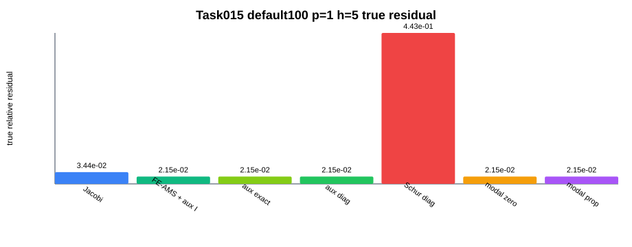
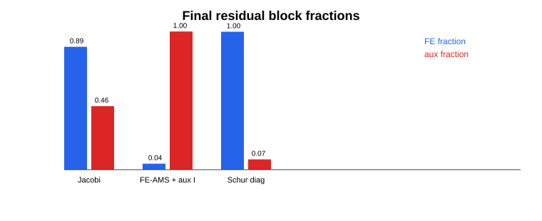
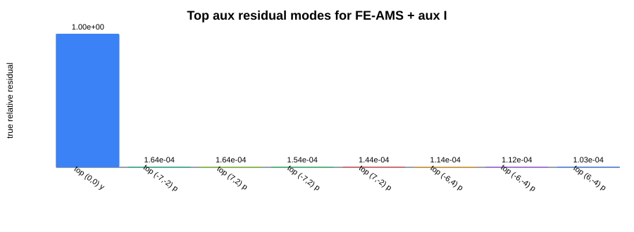

# Outcome Summary

## Task

Task015：reduced Stage 4 DtN/Floquet boundary-aware PC diagnostic。

本轮目标不是继续做黑盒 profile sweep，而是定位 Task014a 中 `FE-AMS + aux identity` 停在 `2.1466e-2` 的主要原因，并给出下一轮应专攻的解法。

## Branch

```text
codex/20260707-real-split-ams-hx-qualification
```

## Final Answer

Task014a 的停滞最可能来自 **Rayleigh/Floquet zero-order modal slow mode 与 FE trace/volume 的 Schur coupling 未被处理**，不是 `A_aux` 对角块本身，也不是单纯的 FE block proxy；当前数据已经把主 residual 定位到 `top, (m,n)=(0,0), y` auxiliary mode。

## Charts







## Baseline Reproduction

| case | profile | iter | true residual | 判断 |
|---|---|---:|---:|---|
| default100 auto | Jacobi | 1000 | 3.436e-2 | 复现 Task014a |
| default100 auto | FE-AMS + aux identity | 1000 | 2.147e-2 | 复现 Task014a，改善仅 1.60x |
| default100 zero_order local Robin | Jacobi | 1000 | 4.397e-1 | 明显更差 |
| default100 zero_order local Robin | FE-AMS | 1000 | 5.337e-1 | 更差 |

Task014a baseline 已复现；数值与 review report 中同量级且一致。

## Residual Decomposition

| profile | true residual | FE fraction | aux fraction | dominant |
|---|---:|---:|---:|---|
| Jacobi | 3.436e-2 | 0.888 | 0.459 | FE 为主，aux 也不小 |
| FE-AMS + aux identity | 2.147e-2 | 0.043 | 0.999 | aux 主导 |
| Schur_diag | 4.427e-1 | 0.997 | 0.074 | 变差，FE 主导 |

解释：FE-AMS 已把 FE residual 压到很小，剩余停滞几乎全在 auxiliary residual。因此继续只强化 FE-only AMS 不是第一优先级。

## Aux Block Diagnostic

| profile | true residual | improvement vs aux identity | 结论 |
|---|---:|---:|---|
| FE-AMS + aux identity | 2.147e-2 | 1.00x | baseline |
| FE-AMS + aux exact | 2.147e-2 | 1.00x | 无改善 |
| FE-AMS + aux diag | 2.147e-2 | 1.00x | 无改善 |

`A_aux` 是 708 x 708 sparse diagonal identity-like block；exact/diag 与 identity 完全同值。因此瓶颈不是 auxiliary diagonal block 自身。

## Schur Diagnostic

| profile | true residual | improvement vs aux identity | Schur size | build time | 结论 |
|---|---:|---:|---:|---:|---|
| FE-AMS + Schur_diag | 4.427e-1 | 0.048x | 708 | 0.266 s | 明显变差，停止该方向 |

`S_aux ≈ A_aux - D diag(A_FE)^-1 C` 是错误的近似方向：它不但没有处理慢模态，反而把 residual 放大并转移回 FE block。下一轮不应继续 full Schur_diag。

## Modal Diagnostic

FE-AMS + aux identity 的 aux residual 投影显示：

| rank | port | order | polarization | relative to aux residual |
|---:|---|---|---|---:|
| 1 | top | (0,0) | y | 0.999999999 |
| 2 | top | (-7,-2) | p | 1.645e-4 |
| 3 | top | (7,2) | p | 1.644e-4 |

几乎全部 aux residual 集中在 `top, zero-order, y` 一个模态上。

但 aux-space-only modal correction 仍无改善：

| profile | modal space | dim | true residual | improvement |
|---|---|---:|---:|---:|
| modal_zero_order | aux-space only | 4 | 2.147e-2 | 1.00x |
| modal_propagating | aux-space only | 708 | 2.147e-2 | 1.00x |

原因很明确：只在 aux 坐标上做 exact correction 等价于继续使用 `A_aux=I`，不能处理 FE trace 与 auxiliary modal unknown 的耦合。

## FE Proxy Upper Bound

| case | profile | iter | true residual | 结论 |
|---|---|---:|---:|---|
| tiny10 auto | same-H1 AMS + aux identity | 37 | 9.601e-7 | 小问题已可收敛 |
| tiny10 auto | exact FE + exact aux | 8 | 1.375e-15 | exact FE 更强，但 tiny10 不代表 default100 |

tiny10 exact FE 说明 FE block proxy 有改进上限，但 default100 中 FE-AMS 后 residual 已 99.9% 在 aux mode，因此 default100 的第一瓶颈不是 FE local inverse 本身。

## Boundary Ablation

| case | profile | true residual | 解释 |
|---|---|---:|---|
| default100 auto auxiliary DtN | FE-AMS | 2.147e-2 | 物理 DtN 路径较好但停在 aux mode |
| default100 zero_order local Robin | FE-AMS | 5.337e-1 | local Robin 明显更差 |
| no_aux / aux_removed | not available | - | 当前 Stage4 path 无安全 no_aux 对照 |

不能把失败归因于“DtN 本身错误”；zero_order 更差说明端口边界物理是必要的。问题是当前 PC 没有处理 DtN auxiliary mode 与 FE trace/volume 的耦合。

## Bottleneck Attribution

| candidate_bottleneck | evidence_for | evidence_against | confidence | next_action |
|---|---|---|---|---|
| DtN aux block | FE-AMS 后 aux fraction = 0.999 | aux exact/diag 与 identity 完全同值 | 低 | 不再单独优化 `A_aux` diagonal block |
| FE/aux Schur coupling | residual 集中在 aux row；aux-only correction 无效；Schur_diag 方向错误但说明 coupling 敏感 | diag Schur 变差，不能直接采用 | 高 | 做 residual-dominant low-rank Schur / lifted coarse correction |
| Rayleigh/Floquet modal slow modes | top zero-order y 占 aux residual 几乎 100% | aux-space-only modal correction 无效 | 高 | 构造 FE+aux lifted zero-order modal deflation |
| FE block proxy | tiny10 exact FE 明显强于 AMS | default100 FE residual 已被 AMS 压到 4.3% fraction | 中低 | 暂不优先，作为组合 PC 的 FE 子块保留 |
| unknown/mixed | Schur_diag 变差，说明简单近似不够 | modal residual 已高度集中 | 低 | 不应继续盲扫 |

Most likely bottleneck: **top zero-order Rayleigh/Floquet mode 的 FE/aux coupled Schur slow direction**。

Recommended Task016: **实现 dominant zero-order mode 的 FE+aux lifted coarse correction / low-rank sampled Schur**。具体不要构造 full 708 x 708 Schur；先只对 `top,(0,0),y` 以及必要的 zero-order symmetry partner 构造 `Z=[FE trace lift, aux coordinate]`，用 `Z^T A Z` 做低维 exact coarse correction，再比较 default100 p=1 h=5。

## Gate Decisions

| question | decision | reason |
|---|---|---|
| 是否有 profile 达到 10x 改善？ | 否 | 最好仍为 2.147e-2，Schur_diag 更差 |
| 是否有 profile 达到 true residual <= 1e-6？ | default100 否 | tiny10 是小问题，不作为 default100 gate |
| 是否允许进入 reduced p=2 h=5？ | 否 | 未达到 10x 或 1e-6 |
| 是否允许进入 full p=2 h=2？ | 否 | p=1 h=5 仍未解决 |
| 是否建议合并代码？ | 否 | 研究脚本仍是 diagnostic |
| 是否建议 docs-only 合并？ | 可选 | 负结果和定位结论有价值 |

## Known Issues

1. PETSc Python monitor callback 与后续 Python PC setup 在当前 Docker 环境中会触发 communicator 错误；已改用 PETSc 内部 convergence history。
2. Schur/modal 中使用 SciPy SuperLU 的 profile 必须单 profile 进程运行，避免与后续 hypre AMS setup 互相影响。
3. modal correction 本轮是 aux-space only，不是完整 volume deflation；这正是为什么它不能解决 FE/aux coupling。

## Next Questions for Review

1. Task016 是否接受直接实现 zero-order lifted coarse correction，而不是继续做 full Schur？
2. dominant mode 是否只取 `top,(0,0),y`，还是先取 top/bottom zero-order x/y 共 4 个 aux modes 做稳健对照？
3. low-rank Schur 中 `P_FE^{-1}` 用 same-H1 AMS apply 是否足够，还是 tiny reference 上先用 exact FE 构造小规模验证？
