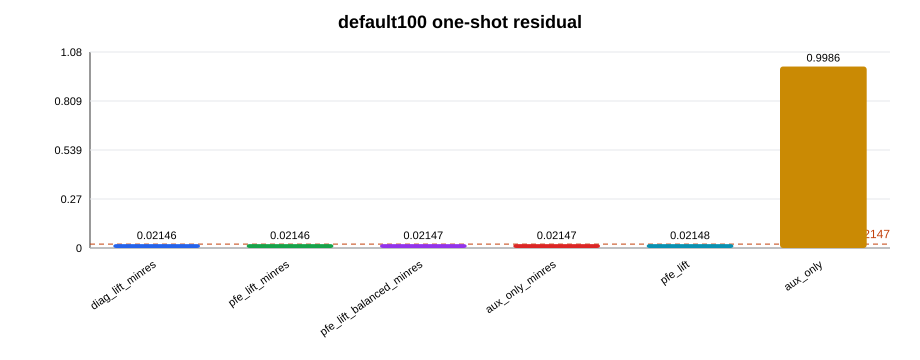
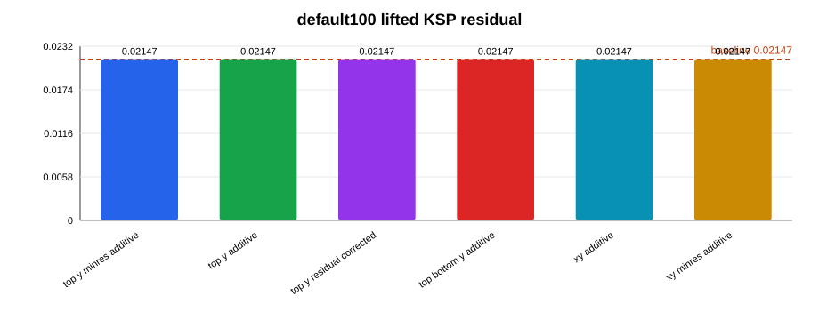

# Outcome Summary

## Task

Task016：dominant zero-order FE+aux lifted coarse correction / low-rank sampled Schur。

本轮目标是验证 Task015 定位出的 `top,(0,0),y` dominant auxiliary residual mode，是否可以通过低维 `Z=[FE lift, aux coordinate]` coarse correction 把 default100 p=1 h=5 的 true residual 从 `2.1466e-2` 显著压低。

## Branch

```text
codex/20260707-real-split-ams-hx-qualification
```

## Final Answer

Dominant zero-order FE+aux lifted coarse correction **不能**把 Task015 的 `2.1466e-2` residual 显著压低。

最好的 default100 one-shot 结果只到 `2.146459669e-2`，改善 `1.000045x`；最好的 default100 KSP lifted profile 为 `2.146563635e-2`，改善 `0.999996x`，实际略差。因此本轮不允许进入 reduced p=2 h=5。

## Charts





## Changed Files

| 文件 | 作用 |
|---|---|
| `src/studies/run_stage4_lifted_coarse_correction.py` | 新增 Task016 lifted coarse correction 研究 runner |
| `docs/task016_zero_order_lifted_coarse_correction/outcomes/*.csv` | mode mapping、粗向量诊断、one-shot、KSP、sampled Schur 与 gate 决策 |
| `docs/task016_zero_order_lifted_coarse_correction/outcomes/charts/*.svg` | 结果图表 |
| `docs/README.md` | 更新 task016 结论 |
| `notes/theory/maxwell_iterative_preconditioners_task012.md` | 更新迭代预条件器路线判断 |

## Run Commands

| 阶段 | 命令摘要 |
|---|---|
| tiny10 complex export | `python3 -m src.studies.run_stage4_real_split_block_pc export-complex --domain-preset tiny10 ...` |
| tiny10 lifted diagnostic | `. /usr/local/bin/dolfinx-real-mode && python3 -m src.studies.run_stage4_lifted_coarse_correction diagnose-real --domain-preset tiny10 ...` |
| default100 complex export | `python3 -m src.studies.run_stage4_real_split_block_pc export-complex --domain-preset default100 ...` |
| default100 one-shot | `. /usr/local/bin/dolfinx-real-mode && python3 -m src.studies.run_stage4_lifted_coarse_correction diagnose-real --domain-preset default100 ...` |
| default100 KSP | `diagnose-real --ksp-only --outer-ksp-type gmres --coarse-omega 0.1/0.01 ...` |
| validation | `python -m py_compile src/studies/run_stage4_lifted_coarse_correction.py` |

## Selected Mode Mapping

default100 的 mode mapping 与 Task015 一致：

| set | mode | port | order | pol | real aux index | imag aux index |
|---|---:|---|---|---|---:|---:|
| top_y | 177 | top | `(0,0)` | y | 39447 | 79425 |
| top_bottom_y | 177 | top | `(0,0)` | y | 39447 | 79425 |
| top_bottom_y | 531 | bottom | `(0,0)` | y | 39801 | 79779 |
| top_bottom_xy | 176 | top | `(0,0)` | x | 39446 | 79424 |
| top_bottom_xy | 177 | top | `(0,0)` | y | 39447 | 79425 |
| top_bottom_xy | 530 | bottom | `(0,0)` | x | 39800 | 79778 |
| top_bottom_xy | 531 | bottom | `(0,0)` | y | 39801 | 79779 |

结论：Task016 选中的 dominant mode 与 Task015 的 aux modal residual decomposition 一致。

## Lifted Vector Diagnostics

| case | set | lift | FE norm | aux norm | FE/aux | coarse cond | 解释 |
|---|---|---|---:|---:|---:|---:|---|
| default100 | top_y | aux_only | 0 | 1.414 | 0 | 1.00 | 已知无效，仅作 sanity |
| default100 | top_y | pfe_lift | 1.414 | 0.0170 | 83.0 | 1.00 | 有非零 FE component，但 FE 分量压倒 aux |
| default100 | top_y | pfe_lift_balanced | 1.000 | 1.000 | 1.00 | 1.00 | 人为平衡 FE/aux 尺度 |
| default100 | top_bottom_xy | pfe_lift | 2.828 | 0.0348 | 81.2 | 1.00 | 扩展到 x/y 也未病态 |

粗矩阵并不病态，主要问题不是 `Z^T A Z` 无法求解，而是候选 coarse space 的 `AZ` 方向与停滞 residual 几乎不重合。

## One-Shot Correction

### default100 p=1 h=5

| rank | set | lift/form | residual after | improvement | FE frac | aux frac |
|---:|---|---|---:|---:|---:|---:|
| 1 | top_bottom_xy | diag_lift_minres | `2.146459669e-2` | `1.000045x` | 0.0473 | 0.9989 |
| 2 | top_bottom_y | diag_lift_minres | `2.146459669e-2` | `1.000045x` | 0.0473 | 0.9989 |
| 3 | top_y | diag_lift_minres | `2.146459669e-2` | `1.000045x` | 0.0473 | 0.9989 |
| 4 | top_bottom_xy | pfe_lift_minres | `2.146474918e-2` | `1.000038x` | 0.0448 | 0.9990 |
| 5 | top_y | pfe_lift_balanced_minres | `2.146517759e-2` | `1.000018x` | 0.0429 | 0.9991 |

`Z^T A Z` Galerkin、最小残差 `min ||r-AZ alpha||`、sign flip、top/bottom pair、x/y zero-order set、balanced FE/aux scaling 都没有达到 2x 改善，更不用说 10x。

### tiny10

tiny10 baseline 已经是 `9.60e-7`，one-shot correction 多数轻微变差；但 KSP lifted PC 在 tiny10 有弱正信号。这说明代码路径不是完全错误，但 tiny10 太小，不能代表 default100 的停滞机制。

## KSP Lifted PC

default100 KSP 结果：

| profile | set | form | omega | iter | true residual | improvement |
|---|---|---|---:|---:|---:|---:|
| top_y_minres_additive | top_y | minres_additive | 0.1 | 300 | `2.146608100e-2` | `0.999976x` |
| top_y_additive | top_y | additive | 0.1 | 300 | `2.146621792e-2` | `0.999969x` |
| top_y_residual_corrected | top_y | residual_corrected | 0.1 | 300 | `2.146639904e-2` | `0.999961x` |
| top_bottom_y_additive | top_bottom_y | additive | 0.01 | 300 | `2.146564882e-2` | `0.999996x` |
| xy_additive | top_bottom_xy | additive | 0.01 | 300 | `2.146564882e-2` | `0.999996x` |
| xy_minres_additive | top_bottom_xy | minres_additive | 0.01 | 300 | `2.146563635e-2` | `0.999996x` |

未阻尼的 `omega=1.0` 多 profile KSP 触发 PETSc FPE；`omega=0.1/0.01` 可以稳定运行，但没有带来改善。稳定化以后仍无效，说明失败不是单纯由 PETSc 崩溃造成。

## Sampled Schur Diagnostic

| case | set | selected dim | residual after | improvement | FE apply count |
|---|---|---:|---:|---:|---:|
| default100 | top_y | 1 | `2.146474918e-2` | `1.000038x` | 42 |
| default100 | top_bottom_y | 2 | `2.146474918e-2` | `1.000038x` | 42 |
| default100 | top_bottom_xy | 4 | `2.146474918e-2` | `1.000038x` | 42 |

这里没有构造 full 708-mode Schur。selected sampled Schur 与 lifted one-shot 同源，结果说明 1 到 4 个 zero-order modes 的 `P_FE^{-1} C` sampled response 不足以解释停滞 residual。

## Failure Attribution

| 假设 | 证据 | 判断 |
|---|---|---|
| mode mapping 错 | selected mode 与 Task015 一致，aux index 清楚 | 基本排除 |
| coarse matrix 病态 | condition 约 1 到 1.05，无需正则化 | 排除 |
| sign convention 错 | sign flip 和 aux sign flip 均无改善 | 基本排除 |
| FE/aux 相对尺度错 | balanced lift 也无改善 | 基本排除 |
| `Z^T A Z` 投影不适合非正规矩阵 | minres 投影略好但只有 `1.000045x` | 不是主因 |
| `P_FE^{-1}C` lift 太弱或不是正确物理误差 | pfe lift、balanced pfe、sampled Schur 均几乎不动 | 高置信 |
| dominant mode 解释不充分 | residual 仍在 aux block，right basis 不能消除它 | 高置信 |

新的判断：Task015 的 dominant aux residual 是现象定位，但“只用右粗向量 `Z=[-P_FE^{-1}C_j;e_j]`”并不能形成有效预条件器。它缺少合适的 left/test space，或者需要更接近 indefinite Maxwell FE inverse 的 lift。

## Gate Decisions

| gate | decision | reason |
|---|---|---|
| default100 residual <= `2e-3` | 否 | best KSP 为 `2.14656e-2` |
| improvement >= `10x` | 否 | best KSP 为 `0.999996x` |
| allow p=2 h=5 | 否 | B gate 未通过 |
| allow full p=2 h=2 | 否 | p=1 h=5 未解决 |
| merge production code | 否 | 研究 runner，且 solver gate 未通过 |
| merge docs-only | 可选 | 负结果和排除结论有价值 |

## Known Issues

1. 未阻尼 lifted KSP 可能触发 PETSc FPE，已用单 profile、`gmres`、`omega=0.1/0.01` 做稳定化排查。
2. default100 KSP 为成本控制只跑 300 步，因为 one-shot 与 300 步结果已经显示没有正信号。
3. 当前 lift 使用 same-H1 AMS 作为 `P_FE^{-1}`，不是 exact indefinite `A_FE^{-1}`。
4. `.npz/.h5/.xdmf` 等矩阵与网格文件只作为本地运行缓存，最终不应提交。

## Next Questions for Review

1. Task17 是否应转向 Petrov/left coarse correction，即同时构造 `Z` 和 `W`，其中 `W` 来自 adjoint residual 或 `A Z`？
2. 是否应对 selected zero-order mode 做少量真正的 indefinite FE solve，近似 `A_FE^{-1} C_j`，而不是继续用 positive same-H1 AMS 当 lift？
3. 是否应暂停 real-split AMS 主线，转向 layered-background / RCWA-like approximate inverse 或 sweeping/domain-decomposition 预条件器？
4. 是否应把当前 runner 保留为研究工具，但不合并到 production solver？
