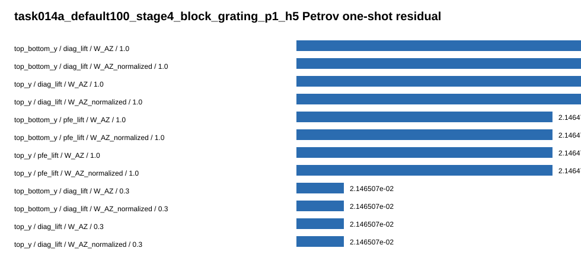
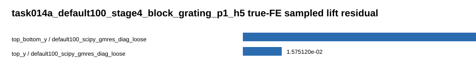

# Outcome Summary

## Task

Task017：Petrov / adjoint-aware zero-order coarse correction and true-FE sampled Schur qualification。

目标是回答 Task016 的 right-only lifted coarse correction 失败后，加入 left/test space `W` 或更接近真实 `A_FE^{-1} C_j` 的 selected-mode FE lift，能不能显著降低 `default100 p=1 h=5` 的 true residual。

## Branch

```text
codex/20260707-real-split-ams-hx-qualification
```

## Final Answer

Petrov / adjoint-aware test space **没有挽救** Task016 的 right-only lifted correction；但 selected-mode true-FE sampled lift 给出了第一个明确正信号。

default100 的 `top+bottom,(0,0),y` true-FE sampled lift one-shot residual 从 `2.146555954e-2` 降到 `3.688783940e-3`，改善 `5.819x`，达到 Task017 的 minimum useful gate，但没有达到 strong gate。把同一个 basis 直接作为右预条件器放进 KSP 后 residual 变成 `2.354987702e-2`，说明当前集成方式不对，不能进入 p=2。

## Charts





## Changed Files

| 文件 | 作用 |
|---|---|
| `src/studies/run_stage4_petrov_adjoint_coarse_correction.py` | 新增 Task017 研究 runner：Petrov one-shot、adjoint test space、true-FE sampled lift、Stage D KSP gate |
| `docs/task017_petrov_adjoint_coarse_correction/outcomes/*.csv` | 本轮数值结果主表 |
| `docs/task017_petrov_adjoint_coarse_correction/outcomes/charts/*.svg` | Petrov 与 true-FE sampled lift 图表 |
| `docs/task017_petrov_adjoint_coarse_correction/outcomes/raw_runs/` | 轻量 JSON、CSV、log 摘要，不保留矩阵 dump |
| `docs/README.md` | 更新 task017 结论 |
| `notes/theory/maxwell_iterative_preconditioners_task012.md` | 更新迭代预条件器路线判断 |

## Run Commands

| 阶段 | 命令摘要 |
|---|---|
| tiny10 complex export | `python3 -m src.studies.run_stage4_real_split_block_pc export-complex --domain-preset tiny10 ...` |
| tiny10 Petrov/true-FE diagnostic | `. /usr/local/bin/dolfinx-real-mode && python3 -m src.studies.run_stage4_petrov_adjoint_coarse_correction diagnose-real --domain-preset tiny10 ...` |
| default100 complex export | `python3 -m src.studies.run_stage4_real_split_block_pc export-complex --domain-preset default100 ...` |
| default100 Petrov/true-FE/Stage D | `. /usr/local/bin/dolfinx-real-mode && python3 -m src.studies.run_stage4_petrov_adjoint_coarse_correction diagnose-real --domain-preset default100 ... --stage-d-omega 0.1` |
| validation | `python -m py_compile src/studies/run_stage4_petrov_adjoint_coarse_correction.py` |
| cleanup | 删除 task017 raw_runs 中的 `.npz/.h5/.xdmf/.vtu/.pvtu` |

## Baseline And Mode Reproduction

| case | mode set | selected mode | baseline residual | real aux index | imag aux index | 判断 |
|---|---|---:|---:|---:|---:|---|
| default100 p=1 h=5 | top_y | 177 top `(0,0)` y | `2.146555954e-2` | 39447 | 79425 | 复现 Task015/016 |
| default100 p=1 h=5 | top_bottom_y | 177 top `(0,0)` y | `2.146555954e-2` | 39447 | 79425 | 复现 |
| default100 p=1 h=5 | top_bottom_y | 531 bottom `(0,0)` y | `2.146555954e-2` | 39801 | 79779 | 复现 |

baseline residual decomposition 仍然显示 residual 几乎全部在 aux block：FE fraction `0.0433`，aux fraction `0.9991`，dominant mode 仍是 `top,(0,0),y`。

## Petrov One-Shot Results

Task017 共生成 320 条 Petrov one-shot 记录，其中 default100 有 160 条，adjoint 类 `W` 有 80 条。

| rank | mode set | Z | W | omega | residual after | improvement | 判断 |
|---:|---|---|---|---:|---:|---:|---|
| 1 | top_bottom_y | diag_lift | W_AZ | 1.0 | `2.146459669e-2` | `1.000045x` | 等同 minres，小幅改善 |
| 2 | top_bottom_y | diag_lift | W_AZ_normalized | 1.0 | `2.146459669e-2` | `1.000045x` | 同上 |
| 3 | top_y | diag_lift | W_AZ | 1.0 | `2.146459669e-2` | `1.000045x` | 同上 |
| 4 | top_bottom_y | pfe_lift | W_AZ | 1.0 | `2.146474918e-2` | `1.000038x` | 无 meaningful improvement |
| best adjoint | top_y | pfe_lift | W_adjoint_diag | 0.01 | `2.146892848e-2` | `0.999843x` | 变差 |
| best PFE-adjoint | top_y | diag_lift | W_adjoint_pfe | 0.01 | `2.244233310e-2` | `0.956476x` | 明显变差 |

结论：`W_aux_residual`、`W_residual_projected`、`W_AZ`、`W_AZ_normalized`、`W_adjoint_diag`、`W_adjoint_pfe` 都没有让 Petrov one-shot 达到 `residual < 1e-2` 或 `2x` 改善。Task016 的 right-only coarse space 不是只缺一个简单 left/test space。

## True-FE Sampled Lift

| case | mode set | FE lift solver | FE solve residual | one-shot residual after | improvement | 判断 |
|---|---|---|---:|---:|---:|---|
| tiny10 | top_y | exact SPLU | `2.49e-15` | `9.601310071e-7` | `1.000003x` | tiny10 baseline 已很小，仅 sanity |
| tiny10 | top_bottom_y | exact SPLU | `3.65e-15` | `9.601240747e-7` | `1.000010x` | sanity |
| default100 | top_y | SciPy GMRES + FE diag | `6.39e-3` | `1.575120238e-2` | `1.363x` | 有改善但未达 2x |
| default100 | top_bottom_y | SciPy GMRES + FE diag | `9.65e-3` | `3.688783940e-3` | `5.819x` | 达到 minimum useful gate |
| default100 | top_y/top_bottom_y | PETSc selected FE AMS | failed | - | - | `PCSetUp` error 101 |
| default100 | top_y | direct SPLU | not run | - | - | default100 FE direct factorization guarded out |

最重要的发现：`top+bottom,(0,0),y` 的 approximate true-FE sampled lift 能显著消除 baseline residual，说明 Task016 的失败主要来自 `P_FE^{-1}C_j` 这个 positive same-H1 AMS lift 太偏离真实 indefinite `A_FE^{-1}C_j`，而不是 modal idea 本身完全错误。

## Stage D KSP Check

| profile | PC form | omega | iterations | true residual | improvement | 判断 |
|---|---|---:|---:|---:|---:|---|
| true_fe_lift_top_bottom_y_minres_additive | right PC, minres additive | 0.1 | 300 | `2.354987702e-2` | `0.911x` | 变差 |

KSP history 从 `93.084` 降到 `2.192`，但 true residual 仍比 baseline 差，last-100 ratio `0.999995`，已经停滞。也就是说 one-shot correction 作为外部校正有效，但直接塞进当前 right-preconditioned FGMRES additive PC 不一致。

## Gate Decisions

| gate | decision | reason |
|---|---|---|
| Petrov W gate | 未通过 | best default100 improvement 只有 `1.000045x` |
| true-FE sampled lift minimum gate | 通过 | default100 top_bottom_y one-shot residual `3.69e-3`，改善 `5.819x` |
| strong gate | 未通过 | residual 未到 `2e-3`，improvement 未到 `10x` |
| KSP consistency gate | 未通过 | Stage D KSP residual `2.355e-2`，差于 baseline |
| reduced p=2 h=5 | 不允许 | 只有 one-shot B 信号，KSP 未稳定 |
| production merge | 不建议 | runner 仍是研究诊断，PETSc selected FE AMS 与 KSP 集成未稳定 |

## Known Issues

1. `default100_iterative_fe_ams_loose` 的 selected FE RHS 解在 PETSc `PCSetUp()` 阶段失败，记录为 error code 101；已用 SciPy complex GMRES + FE diagonal fallback 继续完成 Stage C。
2. true-FE sampled lift one-shot 是正信号，但当前 right-PC KSP 集成方式会破坏它。
3. default100 direct FE factorization 没有运行，因为内存风险与任务边界不匹配。
4. raw_runs 已清理矩阵 dump 和 mesh dump，只保留轻量 JSON/CSV/log。

## Next Questions For Review

1. 是否把下一轮聚焦为 “true-FE sampled Schur correction 的正确 KSP 集成”，例如 initial correction、recycling/augmentation、left-preconditioned residual correction，而不是 right additive PC。
2. 是否允许围绕 `top_bottom_y` 做更准确的 selected FE solve，例如更严格 GMRES、shifted/absorbing FE solve、或小规模 BLR/direct 只解 2 个 RHS。
3. 是否把 Petrov/adjoint W 路线暂停，把资源集中到 true-FE sampled Schur。

一句话结论：Petrov / adjoint-aware coarse correction 没有挽救 Task016，但 true-FE sampled lift 找到了一个可继续深挖的正信号；当前不能进 p=2，也不能合并 production solver。
