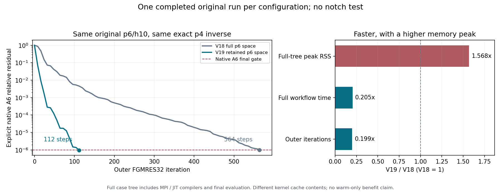

# Review V19 的 X0–X3 完整证据


单元凝聚是在每个有限元单元内先解掉内部未知量，只迭代相邻单元共享的边界与原80端口；最后把内部场准确恢复。本轮把这个过程也用于p6，p4继续用V18准确凝聚LU。这样减少外层向量与全局纠错次数，代价是新增局部缓存；原p6本来就是matrix-free，没有删除一张原本存在的全局A6矩阵。

| 指标（同一 original，Full3D p6/h10，13.5 nm，MPI1） | V18 准确 p4、完整 p6 空间 | V19 p6/p4 双层凝聚 | 结论 |
|---|---:|---:|---|
| 外层向量长度 | 173802 storage | 51272 trace＋端口 | 少70.50%，属于载荷/维数变化 |
| FGMRES32 步数 | 564 | 112 | 少80.1418% |
| KSP 算子作用 / 求解PC | 581 / 564 | 115 / 112 | 同一KSP；X1另1次PC |
| 原 A6 最终真实残差 | 9.92314718715201e-7 | 9.730817853580687e-7 | 均≤1e-6 |
| L2 / scaled-curl | 1.3644783293e-8 / 4.3714257233e-9 | 1.5860495296e-7 / 1.5359268899e-7 | 均≤1e-4；新场误差没有更小 |
| 全过程树 RSS，B | 2528460800 | 3965534208 | **增加1437073408 B，+56.8359%** |
| 同口径 PSS，B | 2494237696 | 3931141120 | +57.6089% |
| 数值常驻库存，B | 1830284886 | 2031387110 | +201102224 B，+10.9875% |
| 同时临时池上界，B | 396129600 | 423441224 | +6.8946%；不是RSS |
| 完整流程 monotonic，s | 6609.6613787800015 | 1352.0121227929922 | **减少5257.649256 s，-79.5449%** |
| 保守账本结算，s | 7210.314084736167 | 1474.858420017083 | 与monotonic分列，不相加 |
| 完整数值 / 物理 / 资源安全 | PASS / PASS / PASS | PASS / PASS / PASS | 资源安全不等于节省内存 |

**推荐把V19保留为下一轮唯一优先验证候选：此固定模型完整通过，时间显著降低；同时承认内存退步，V18保留为内存较低的已通过基线。** 这不是生产默认切换或新计算授权。状态为`PASS_ORIGINAL_TIME_GAIN_MEMORY_REGRESSION`，不能写成“全面省资源”，也不能忽略实测时间收益而写成“无任何资源收益”。

新original仅一场、无正式重放；独立用户服务正常结束，整树零swap且清场。旧notch保持用户关闭/最终未知，本批没有notch、BLR、其他PC、参数扫描或新参考，不影响5nm线。完整数据和同scope边界见下方报告；普通默认不变，不合并master，等待统一审阅。



图中只比较已经完成的original；时间减小而峰值RSS增加，内存中计入新增JIT。

## 1. 身份、模型与复现入口

| 项目 | 精确身份 |
|---|---|
| 用户指定base | `3c7b6ecfd7aede2651dd973052a097dbed601d03` |
| 正式数值源码 / source_after | `8eff068b06f4713cc6d1281c92ed82d370060403`；运行前后tracked和nonignored均clean |
| 已接受V18 original源码 | `8a2d5cbba6ed834a6d731a30dd3735c8824fa762` |
| 分支 / profile | `task39extra` / `physical_p6_trace_p4_condensed_balh_v19` |
| physical / mode SHA | `9142440056196b0c6d4c579f0a1e17e79c1fad7cf0b626206fbd343837804a0f` / `dee5c3ac0e5fccb8745fcef29ad0e17c8bc31717ea901c098ea1fdd5dee37bf2` |
| 输入 / resolved SHA | `38c375fd74366d2fe9adea75d71c13f946b4b79d4c3b0aef5bb57805b35ba1c6` / `7f4591c8fc24eb53bd4dfad7cc44bcf3ce5349a232e77ab6d586eeb76ca0fc4b` |
| 原物理RHS数组SHA | `e8ece14d273d8bcdec672f2e29ac8c62971bb0d0fe4af7cc63e741df21934686`，与V18相同 |
| 环境 | WSL Linux，MPI1/线程1；complex128/int32，PETSc3.19.6，DOLFINx0.10.0.post2/Basix0.10.0，MUMPS5.6.2；未升级ABI |
| 模型 | 50×25 nm，z=-10…130 nm，Si/air，13.5 nm，1°掠入射，phi=0，s极化；252 affine hex，p6/h10 |
| 正式根 | `results/euv_grazing1_phi0/task39extra_v19_x2_dual_condensed_original__full3d_iterative__mpi1__Mna/20260914T105711.660799Z` |
| 独立服务 | `myfenics-case-20260914T105711-368715.service`，invocation `e806a66ce6b64696b43e8114d2a99fa4` |

在资格化WSL同一个shell中执行的公开入口如下。此处为复现记录，结项不再执行：

```bash
source scripts/activate_myfenics_wsl.sh
bash scripts/run_case_in_user_service.sh input/task39extra/v19_x2_dual_condensed_original.dat --v14-time-policy observe_only
python -m benchmarks.check_dual_cell_condensed_v19 results/euv_grazing1_phi0/task39extra_v19_x2_dual_condensed_original__full3d_iterative__mpi1__Mna/20260914T105711.660799Z --output benchmarks/artifacts/task39extra/dual_cell_condensed_v19/root_engineering/x2_independent.json
```

canonical worktree登记位于`/home/shenjh/Projects/MyFEniCS-Surrogate/.git/worktrees/worktree`。完整源码、输入、资源、数组和结果hash见[compact](records/dual_cell_condensed_v19_compact.json)。远程最终文档提交SHA在本轮回复中给出；正式数值身份始终为8eff，不用文档提交冒充计算源码。

## 2. X0：必要小检查与服务生存

最终focused **82 passed / 1 skipped（MPI2/MPI4专用，当前MPI1不适用）**，覆盖复非Hermitian/非零Bi、Di、内部与端口RHS、MPC、局部FE、逆桥、重复/线性/清理、非交换反例、retained KSP/dispatcher/ledger/checker，以及旧V18与action-only组件。compileall和公开dat validate-only通过；未重跑未受影响p4 U2/U3。Ruff未安装；full repository pytest、MPI2/4正式资格和CI未运行，不声称通过。

一次非PDE服务测试的第一次工程尝试漏传已有`phase_path`，导致探针取watchdog专用PID环境变量时KeyError；子进程已清理。仅修正同一探针，第二次通过：调用shell返回后parent351792仍由用户systemd436托管，后续独立调用PID352078释放完成事件，正常保存终态并清场；20.720674411 s、RSS43266048 B、swap0。这是一个测试、两次小工程尝试、零PDE，旧notch未启动。没有timer、linger或系统设置改动。

正式前主控审阅修正端口重复数组、无用MPI scatter缓存、非零端口RHS归一化及native恒等式；小端到端测试还揭示小非零RHS被绝对floor误判，已修到只在零/下溢尺度使用绝对舍入准则。旧测试失败保留，全部修复早于clean正式source。一次admission写后tuple/list断言不匹配也保留，文件本身已原子写入且独立回读/hash通过，未导致PDE重跑。

正式前磁盘/宿主卷、ABI、无heavy、内存reserve、安全线均通过；45个冻结历史文件和24个旧profile不变。测试日志：`benchmarks/artifacts/task39extra/dual_cell_condensed_v19/root_engineering/x0_precommit_focused.log`，SHA256 `db6c054ef70a6f0fa4b298267148321c41336f104ea6698cf65e67f7d977cb28`。

## 3. p6实际算子、逆桥与X1

实际p6 storage173802、独立full164592、内部113400、独立trace51192，外层向量51272。252单元共享12套450阶局部LU/432阶Schur及恢复数据，raw tensor只5类；完整curl＋复材料张量先合并再消元。p6仅局部Schur/恢复缓存和稀疏端口action，没有全局A6/S6 CSR/AIJ/稠密矩阵或因子，NNZ全局字段为null（不存在），不是假报0个非零。p4是一份21824行、8184464 NNZ的全局准确凝聚因子，无逐单元MUMPS或旧宏块。

新PC不是截断P64。对保留残差先用J^H注入完整FE＋端口空间，内部置零；用原H_p处理端口，再调用原BAL_H，最后用J提取trace和端口：

```math
w=r_{FE}-BH_p^{-1}r_p,\qquad z=\mathcal B_{6,H}w,\qquad a=H_p^{-1}(r_p+Dz),
```
```math
\mathcal M_{\Gamma,6}=J\mathcal M_{aug}J^H,\qquad \mathcal S_6^{-1}=J\mathcal A_6^{-1}J^H.
```

该准确块逆恒等式说明桥的构造，不保证近似BAL_H收敛；没有假设`S4=Pt^H S6 Pt`。J不额外应用Floquet C/C^H，PC/p4返回严格slave-zero；后处理只在副本上backsubstitute。非零内部RHS按原公式缩减并恢复，Bi/Di和Hhat完整保留，原Hp与修正Hhat不混用。

| X1固定向量 | native恢复恒等式操作尺度误差 | 要求 |
|---|---:|---:|
| trace | 5.976681952784583e-14 | ≤1e-10 |
| port | 8.526840123946018e-17 | ≤1e-10 |
| mixed | 5.959102809238775e-14 | ≤1e-10 |

内部恢复误差最大3.2894767089154497e-15，Schur端口恒等式最大3.735884201656119e-17。一次实际X1 PC准确计数BAL_H=1、H6=1、p4 MatSolve=2；没有单次降残差筛选。X1检查/单PC耗时22.411679 s，已包含在本场总成本。其任意测试向量的原A6残差不应接近零；所判的是与原算子一致性。X1通过后同根、同对象直接进入X2。

p4真实CSR hash在factor前后均为`19b9fbf759e6dc586d1316b53c69099647bd3a23e43378535b718c1db2c218d8`，与V18相同；ICNTL35=0、ICNTL10=0。p6 cache内容hash前后均为`c79e781afb4b866db0e38bcaafd92d80f8148c847e1de6bec594ebc4994db62e`，载荷不增长。p6按local tensor/LU/map/carrier/recipe绑定身份，没有虚构S6 CSR hash。

p4后端读回INFOG19=1462 decimal MB、INFOG22=837 decimal MB，按原保守换算分别记allocated upper=1463000000 B、used upper=838000000 B；矩阵已分配数值/索引载荷232205060 B，p4共享局部LU/恢复缓存11327040 B。它们属于对象/后端口径，不代替整树RSS，也不通过仅用used缩小账面库存。ICNTL23读回1953 MB是额度，不是实耗。

## 4. X2完整original：残差、场和物理

一次right FGMRES32，零保留初值、最多2048步；完整恢复初值允许含非零内部RHS特解。实际112步结束，只有一个KSP。旧64步0.1线仅观察，时间全程observe_only，没有替换PC、延长步数或第二次solve。以下列首个同迭代显式记录；restart边界重复评价也全部保存在compact。

| 外层步 | V19 原A6真实残差 | V19 Schur真实残差 | V18 同步原A6残差 |
|---:|---:|---:|---:|
| 0 | 1.0 | 1.0 | 1.0 |
| 8 | 7.1498844334e-2 | 7.1498844334e-2 | 8.7385144870e-1 |
| 16 | 9.0359094119e-3 | 9.0359094134e-3 | 4.7616955696e-1 |
| 32 | 2.8444254527e-4 | 2.8444254518e-4 | 7.3122592539e-2 |
| 64 | 1.7690954652e-5 | 1.7690953836e-5 | 1.9157476408e-2 |
| 96 | 1.4932835709e-6 | 1.4932834956e-6 | 5.7438010517e-3 |
| 104 | 1.3902011012e-6 | 1.3902013669e-6 | 5.3155889155e-3 |
| 112 | 9.7308178536e-7 | 9.7308194670e-7 | 4.5780069944e-3 |
| V18最终564 | — | — | 9.9231471872e-7 |

每8步Schur和恢复后原A6数组已保存；19次显式快照含restart/最终重复，22次native检查含3个X1。每32步先保存y，再评价场：

| 步数 | L2相对场误差 | scaled-curl相对误差 |
|---:|---:|---:|
| 0 | 1.0 | 1.0 |
| 32 | 4.3148347824e-5 | 4.2241403977e-5 |
| 64 | 3.8951169919e-6 | 3.7217876006e-6 |
| 96 | 1.9964600152e-7 | 1.8911716727e-7 |
| 112最终 | 1.5860495296e-7 | 1.5359268899e-7 |

参考只参与评价，没有进入PC、参数选择或初值。最终退出后再次独立native A6得9.730817853580687e-7；保留包重算9.730817853580463e-7，两者只有舍入差。

| 原物理/恢复最终Gate | 实测 | 限值 |
|---|---:|---:|
| 原A6相对真实残差 | 9.730817853580687e-7 | 1e-6 |
| 端口方程操作尺度闭合 | 5.8476980231808125e-16 | 1e-8 |
| 内部恢复误差 | 2.1627175873860883e-17 | 1e-10 |
| `e_native=e_FE-B Hp^-1 e_p`恒等式 | 8.175908441682495e-12 | 1e-10 |
| Schur/端口恒等式 | 1.1206608495164462e-29 | 1e-10 |
| 完整80模式复幅值相对差 | 1.4777111110917282e-7 | 1e-4 |
| 逐模式功率最大绝对差 | 2.4579416113557073e-8 | 1e-6 |
| E / H采样相对差 | 2.2784671388e-7 / 1.6519578233e-7 | 各1e-4 |
| 界面切向E / H相对差 | 1.9445633540e-7 / 8.2919247879e-7 | 各1e-4 |
| `abs(R+T+A_volume-1)` / `abs(A-A_volume)` | 1.8197542295261826e-7 / 同值 | 各1e-5 |

original正式R/T/A/A_volume分别为0.3656258136701664 / 0.012990624019505325 / 0.6213835623103282 / 0.6213833803349053；与既有同离散参考的绝对差分别2.45693e-8 / 8.39222e-9 / 1.61771e-8 / 1.98158e-7，均≤1e-5。零级反射R00_s=0.3655891356275745、R00_p=1.2425668917094962e-16、R00_total=0.3655891356275746。完整80模式逐项复幅值、通道功率及原key/phase在compact与原生端口输出中；不把另一个50通道采样Fourier诊断替代official端口结果。原生功率文件中尚未合并体积吸收的null闭合字段保留，由独立checker联合volume_absorption重算守恒，不改写原文件。

本机独立checker从hash-bound数组、原始resource timeline与原生物理文件重算所有Gate为PASS；只看worker的status不足以得出该结论。第一次直接脚本方式调用checker发生module搜索路径错误，按仓库模块入口`python -m`从相同数据成功；没有重跑计算。

Luna的最终只读审核为`PASS_WITH_SCOPE_NOTES`，未发现实质实现错误；主控复核43项独立checker条件、完整80模式和内存/时间口径通过。复用的终态枚举仍含`FULLSPACE`字样，表示完整原方程/物理评价；实际外层向量长度由新profile与KSP事实记录为51272。

## 5. 全局工作、内存与完整时间

实际p4 MatSolve总226次=2×(112求解PC＋1次X1)，每次只一次全局回代，原A4最大残差5.0455949355168026e-11≤1e-10；H6/BAL_H各113次。p6局部Schur总137次=115个KSP action＋19个显式action＋3个X1；原A6仍用于BAL_H和独立检查。向量变短、总回代/算子次数减少已有实证；实际FLOP和独立正交化耗时未测，不能由维数直接宣称某个百分比的浮点工作削减。

65个FGMRES32示例V/Z向量的载荷差为127431200 B（121.53 MiB，derived）；按现有74向量安全池计算差145075520 B。新增p6独占数值数组201102224 B比65向量节省多73671024 B；即使按74向量仍多56026704 B。载荷不是RSS，不能用这两数相减预测全过程峰值。

| 新p6常驻载荷分项 | B |
|---|---:|
| 12类内部LU及pivots | 38901600 |
| 恢复 `interior_from_trace` | 37324800 |
| RHS缩减 `trace_from_interior_rhs` | 37324800 |
| 内部RHS投影 | 19440000 |
| 局部Schur | 35831808 |
| 单元map/稀疏展开 | 24780960 |
| 端口、trace与其他map | 7498256 |
| 去重合计 | 201102224 |

全过程峰值含case parent、MPI、worker以及JIT/compiler后代，两场都保留因子到完整物理评价后，均不包括systemd用户管理器。V19峰值3965534208 B位于p6 setup的第155.140523 monotonic秒：worker2337185792 B、cc1编译器1574236160 B，加parent36798464/mpi14495744/gcc2818048 B。V18峰值2528460800 B位于第6604.088429秒：worker2052399104、cc1421896192，加parent36900864/mpi14417920/gcc2846720 B。

两者都是实际全过程采样，不是新warm峰值对旧cold峰值；已有缓存复用，但新p6内核有新增JIT，缓存内容并不相同。因此**完整已运行场的RSS与时间比值可比较；去除编译后的warm-only因果收益和多场稳健性仍未测**。不剔除新编译成本、不给编译器另设预算，不重跑基线。每阶段采样、compiler PID与hash在compact的resource_scope中；parent样本stage粗标签为workflow，细事件可定位setup。无全局A6/S6矩阵内存可被“省掉”。

| 时间口径 | 实测秒 | 范围/是否嵌套 |
|---|---:|---|
| 新场完整workflow monotonic | 1352.012123 | 主比较分母，含X1、输出和清场 |
| parent watchdog monotonic | 1351.967900 | 较窄的监督窗口，不与总量相加 |
| worker全流程 monotonic | 1349.662533 | 较窄worker窗口 |
| p4 setup / symbolic / numeric | 32.614560 / 0.225520 / 21.178048 | symbolic/numeric在setup内 |
| p6完整adapter setup | 160.878790 | 包含form/JIT、builder、端口、hash和RHS |
| p6 builder / tensor核 / 局部Schur | 108.013163 / 102.160617 / 5.290706 | 后两项嵌套builder |
| X1三向量与一次PC | 22.411679 | 在workflow内，单列费用 |
| `ksp.solve` monotonic | 1049.785037 | 包含PC、action、检查与周期评价 |
| lift/BAL_H/drop桥总 / 其中BAL_H | 980.540728 / 978.177721 | 含X1；不可重复相加；差2.363007 s含包裹开销 |
| BAL_H结构A6 / coarse作用 / H6 | 324.192146 / 379.013466 / 261.022926 | 嵌套BAL_H；coarse含transfer和p4核验 |
| 226次p4缩减—MatSolve—恢复合计 | 46.998367 | 上项coarse的子集 |
| 上项加native A4核验 | 144.621546 | 仍为coarse子集，不与46.998相加 |
| p6 Schur action合计 | 8.914197 | 134个adapter action，X1另由core计数 |
| recovery/evaluation / 其中native A6 | 68.264859 / 31.565156 | 含X1与所有残差评价 |
| KSP周期场评价 | 14.532779 | KSP内5份field checkpoint计时 |
| adapter保存包总 | 1.311759 | 嵌套其他阶段 |
| 最后worker采样区间 | 11.206276 | 含native完整物理输出、比较、清理/summary准备，不冒作纯后处理CPU |
| 正交化、p4缩减/MatSolve/恢复分别计时 | unknown | 仅有组合区间，未重跑或伪造 |

曲线中的`solve_seconds`及solver.elapsed_seconds=1148.326181 s来自保守clock callback，不是1049.785037 s的纯`ksp.solve` monotonic；新账本1474.858420 s亦单列。UTC与monotonic全流程差约122.844030 s，沿原conservative计费观察且无时间veto，不把差额隐藏或归因于算法。旧V18比较也严格用6609.661379 monotonic。

安全实测：whole-tree RSS3.966 GB<8 GiB，常驻2.031 GB<6 GiB，临时0.423 GB<1 GiB；reserve≥4 GiB，job swap0/global新增swap0/0、无OOC。服务最终inactive/dead、Result=success、ExecMainStatus=0，全部记录的parent/MPI/worker/编译后代已清空；完整原watchdog留存。因子与p6缓存释放事件均晚于最终物理比较，不靠提前释放或heap trim制造峰值。

## 6. 账本、负结果与结论边界

新batch账本只一场、正式bug replay0、基础设施恢复0、active_attempt=null，保守结算1474.858420017083 s。旧V18账本只读hash `3e0cfa997a4b96f2d0b4f546ce5f423182d6eb571a6d777ebf406a7e8ab1aab7`保留已结算7709.1817335480555 s与43200 s政策占用；历史600 s unknown仍在前驱记录，均不返还、不混为实耗，不重复相加。不采用worker运行中未结算shared_budget快照充当最终账本。

工程X0起止UTC观察及monotonic unknown保留在compact，测试/非PDE探针与formal成本分开；不声称完整工程CPU时间已测。旧BLR、宏块、Schur/SVD失败及用户关闭notch全部保留；本批未为补metadata重跑旧结果。13.5 nm固定original的成功不是连续极限、任意非可分模型或0.7 nm/2 TB可扩展性证明，p4全局trace LU仍增长。当前唯一后续建议是审阅V19时间—内存取舍，再另行决定非可分/扩展验证；无自动计算、无master merge。

[compact](records/dual_cell_condensed_v19_compact.json)、[decision](records/dual_cell_condensed_v19_decision.json)、[run index](records/run_index.json)、[测试记录](test_summary.md)、[selective边界](selective_merge_manifest_v20.md)构成可独立审阅入口。原始数组、完整轨迹、大型E/H和矩阵留在ignored，Git只提交轻量结果与hash。
