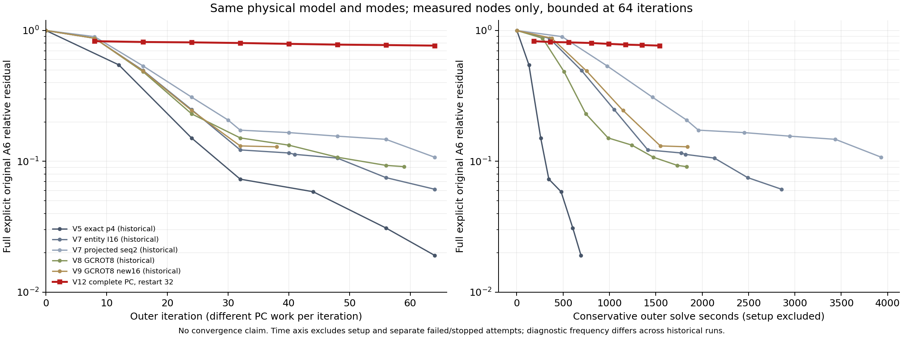

# Task39extra V12 补充中心结果：完整 PC 效率不足，排除当前冻结配置

## 范围与判断

用户授权在不要求收敛的条件下用几十步比较完整 PC，随后允许“太差就停止”。本补充完成全部 O1 控制和 R32 的 64 个实际外层步；R64 按用户要求受控停止。**当前冻结的 `physical_macro_dd4_v12 + BAL_H` 配置从本轮候选中排除。** 依据是内部修正弱、完整外层改善小、场误差后段恶化及历史同模型的成本对照，不是单凭最终 `1e-6` 尚未收敛。

PC 为外层求解提供误差修正：本配置先分解 42 个多单元完整物理 p4 局部块，结合已有全局粗修正 C_U 得到 B4；每次 I4 从零做最多 4 次新 B4，再由 BAL_H 组合成原始 p6 方程的修正。局部回代很准确，只说明小块自身解得准；I4 是否能有效修正跨块误差，需要真实 p4 误差及原始 A6 外层试验回答。

| 身份 / 冻结条件 | 本次值 |
|---|---|
| 模型 | 原始 13.5 nm、Full3D、p6/h10、252 hex、80 DtN 模式、MPI1×线程1、complex128/int32 |
| p6 / p4 independent 与 storage rows | p6 `164592/173802`；p4 `48960/53084` |
| physical SHA | `9142440056196b0c6d4c579f0a1e17e79c1fad7cf0b626206fbd343837804a0f` |
| ordered mode SHA | `dee5c3ac0e5fccb8745fcef29ad0e17c8bc31717ea901c098ea1fdd5dee37bf2` |
| 两次 O2 的 operator identity | `719aa45defe4fb76d057a2de6fd3077fb54ec07668032db09b2a3fa8ed00a7f7` |
| 运行源码 | O1 / 首次失败 R32：`7d9df5e19d324776588aaa9efc4996cc3fe36d8e`；修复 R32 / 停止 R64：`d39261bb17e8d9042c03d4d4990258da5043b621` |
| 内部与资源 | I4 四步，旧 V11 symbolic 配额与 ABI 资格复用；仅 V12 局部库存 cap 为 `2684354560 B`，旧 profile 仍为 `2147483648 B` |
| 预算 | supplement 总计 10800 s；O1 workflow/controls 为 3600/1200 s；每个 O2 workflow/outer 为 3600/2400 s；外层最多 64 步 |

参考采用已有合格的离散参考场和原始输入绑定，不重建全局参考。没有块/rank/步数扫描、第三框架、ABI 升级或新的 original/notch 收敛运行；不影响 5 nm 工作。结论仅限本次冻结模型、配置与已测步数。

## 1. 内部质量：局部解准确，四步 I4 修正仍弱

每次 fresh build 均完成 42 个独立 numeric macro factor 和 84 个 witness 核对，覆盖 p4 全部 48960 个独立行；C_U 的 18 个内部响应类因子属于另一层，不能拿它替代 42 个宏块。四次构建的独立库存审计均为 759 checks / 0 errors，最大局部回代残差 `2.1772149386553977e-15`。

六条固定 p4 控制都从零开始、只作四次新 B4，以合法 `INNER_APPROXIMATE_RETURN` 返回；没有达到内部 `1e-4`。下表的 field 是相对已有离散参考的无损 L2 场误差，curl 指以 k0 缩放的旋度误差。bare 表示只应用一次 B4，用来观察四步 I4 是否确实改善了场。

| p4 record | bare L2 | I4 true residual | I4 L2 | I4 scaled curl | I4 保守秒数 |
|---|---:|---:|---:|---:|---:|
| A2R160 / 01 | 0.848992 | 0.9502310252350668 | 0.9647147926182198 | 0.964639027200986 | 8.858072733996924 |
| A2R160 / 02 | 0.914618 | 0.1012649488434464 | 0.8777570760481551 | 0.8773717677729929 | 6.144728413995638 |
| LIGHT448 / 09 | 0.858182 | 0.9778952412775763 | 0.9928176043406823 | 0.9928022756707928 | 6.104448737998296 |
| LIGHT448 / 10 | 0.915431 | 0.10194959659698315 | 0.8775511199054001 | 0.8771869820432219 | 5.899943810000565 |
| JOINT448 / 17 | 0.851538 | 0.9734051084398233 | 0.9806440886743487 | 0.980603344241886 | 5.98696707299945 |
| JOINT448 / 18 | 0.914965 | 0.1011280660537276 | 0.8789881692075479 | 0.8786124210764896 | 5.896728401001368 |

这些 record stem 中的 BAL_H 是历史输入 packet 标签，不代表六次完整外层求解。六条 p4 保存向量/范数/单元能量核对共 132 checks / 0 errors；A4 误差身份误差为约 `1e-14–1e-13`，支持数据与算子关系，但不意味着 I4 已收敛。O1 全部控制实测 12 次 I4、6 次 bare B4，总计 54 次 B4、2268 次局部 M_D solve。

完整 R32 外层中实际发生 **128 次 I4、512 次 B4、21504 次局部 M_D solve、1024 次 C_U/p2 修正、64 次 H6 作用**。128 次 I4 均遵守单 KSP、零初值和四步限制；达到内部目标为 **0/128**，内部真实残差范围 `0.035642887760131345–0.9943595875621468`，最长 `10.24374708600115 s < 30 s`。因此问题没有表现为内层超时或越界，而是允许的有限修正效果不足。

## 2. 框架耦合：按规则选择 BAL_H

三组保存的同一 q 输入及参考误差 e 均有效；两种组合共用同一次 zc 和 s，BAL_H 额外计算第二次 I4 反馈。下面的作用秒数是这些组成操作的 **单调计时相加**，强制审计和场评价另计；不是两次相互独立的完整调用耗时。所有工作均已包含在 O1 父 workflow 费用中。

| shared q | BAL_H 残差 / L2 / 秒数 | ONE_C 残差 / L2 / 秒数 |
|---|---:|---:|
| A2R160 | 1.029005 / 0.980965 / 19.696033 | 1.063886 / 0.981954 / 12.461045 |
| JOINT448 | 1.146088 / 0.987957 / 19.240006 | 1.169587 / 0.988469 / 12.267065 |
| LIGHT448 | 1.072020 / 0.994031 / 19.444603 | 1.091112 / 0.994314 / 12.449865 |

| ONE_C 切换条件（ONE/BAL） | 实测 | 原限值 | 判断 |
|---|---:|---:|---|
| L2 几何平均比 | 1.000603999343256 | ≤0.8 | 不满足 |
| scaled-curl 几何平均比 | 1.0006040295274625 | ≤1.1 | 满足 |
| 最大 L2 比 | 1.0010085925170666 | ≤1.1 | 满足 |
| 残差几何平均比 | 1.0240463212446451 | ≤1.0 | 不满足 |
| 累计组成操作时间比 | 37.177975295999204 / 58.38064195399784 = 0.6368202549964133 | ≤0.8 | 满足 |

因此按冻结规则保留 **BAL_H**。raw `framework_decision.gate_pass=false` 专指 ONE_C 切换条件未全部满足，不是 O1 workflow 失败；O1 为 `M1_CONTROLS_COMPLETED`。单次 PC 作用的残差比大于 1，也不等同于外层 Krylov 已失败。

shared-q 保存记录的独立算术与选择重算为 96 checks / 0 errors。R32 外层累计执行 3 次耦合审计；保存的末次 `eps1-eps2` 闭合相对误差为 `1.4796776236757317e-13 < 1e-8`，其分子/尺度已独立重算。前两次的完整成功向量和闭合标量没有单独持久化，不将末次重算冒称为逐次独立重放。

## 3. 实际外层效果、有限 restart 与历史比较

| R32 外层步数 | 原始 A6 全显式残差 | L2 场误差 | scaled-curl 误差 | 保守节点秒数 |
|---:|---:|---:|---:|---:|
| 8 | 0.8283760020203784 | 未评价 | 未评价 | 183.5810945069988 |
| 16 | 0.8172376273064963 | 未评价 | 未评价 | 363.629365240012 |
| 24 | 0.811621467511064 | 未评价 | 未评价 | 561.9847062710234 |
| 32 | 0.8025891203479081 | 0.9384007607744688 | 0.9382432819659642 | 803.398775809017 |
| 40 | 0.7905768439658885 | 0.9384713437546844 | 0.9383099786075562 | 989.4838488080101 |
| 48 | 0.7800045793916733 | 0.9450025437287738 | 0.9448393944381559 | 1172.5784593690012 |
| 56 | 0.7740566932047386 | 0.9458195031845654 | 0.9456489074125051 | 1348.9276929709918 |
| 64 | 0.7666389832389989 | 0.9488237463600627 | 0.9486448577201997 | 1540.2073412299874 |

R32 完成两个有限 32 步周期。第 32→64 步残差进一步下降，但相对离散参考场的 L2/curl 误差增大；这直接表明不能用局部 PASS 或单独残差下降宣布完整 PC 有效。R32 workflow 是 `COMPLETED`、summary 是 `O2_CANDIDATE_COMPLETED`，但数值残差和场误差 Gate 都是 `measured_not_met`。

R64 使用相同源码、算子、物理 RHS、PC 和零初值，在完成 R32 前置检查后才开始。按用户要求通过现有 watchdog 停止，raw 分类为 `USER_CONTROLLED_STOP`；全部子进程清空，未使用 SIGKILL。保存的 8/16/24 步与 R32 **逐字节相同**，残差依次为 `0.8283760020203784 / 0.8172376273064963 / 0.811621467511064`。R64 没有最终 candidate/I4 计数，也没有第 32 步及终态证据，故不完成 restart 选择、不推算未保存节点时间。取消逐段 MR 与有限 restart 是两个不同设置。

历史数据只读取已有 hash-bound 记录，没有新增 PDE。下表都是同一物理/模式身份的实际节点，秒数为各记录的保守外层求解计时；不插值，不把不同 PC 的一步视为相同工作量。

| 配置 | 32 步残差 / 秒数 | 64 步残差 / 秒数或实际末点 |
|---|---:|---:|
| 本轮完整 PC，BAL_H，R32 | **0.802589 / 803.399** | **0.766639 / 1540.207** |
| V5 exact-p4 BAL_H，历史诊断 | 0.073123 / 346.127 | 0.019157 / 692.572 |
| V7 entity I16 | 0.122313 / 1414.353 | 0.061294 / 2854.520 |
| V7 projected-seq2 | 0.173168 / 1959.473 | 0.107669 / 3930.345 |
| V8 GCROT8 | 0.151104 / 985.329 | 无 64 步；末点 59 步为 0.091143 / 1831.844 |
| V9 GCROT8 new16 | 0.131238 / 1549.065 | 无 64 步；末点 38 步为 0.129201 / 1842.250 |

左图按步数、右图按保守外层秒数比较；连线只用于阅读。V5 使用已有全局 p4 参考因子，资源策略不同；没有把它提升为本轮第三框架。历史 PC 的前置阶段至 solve_start 时间分别约为 V5 `729.341 s`、V7 entity `203.408 s`、V7 seq2 `201.504 s`、V8 `214.610 s`、V9 `212.643 s`，它们不在图中。历史完整长跑的资源峰值也不等于 64 步前缀峰值。本轮在 32/40/48/56/64 步增加场诊断，历史采样频度不同；下节另列建造、诊断、失败和停算成本，不把图解释为严格相同计时范围的算子消融试验。

## 4. 总成本与全过程内存

| 实际运行 | 保守计费 / s | 单调经过时间 / s | RSS 峰值 / B | 可读 PSS 最大值 / B | 采样数 |
|---|---:|---:|---:|---:|---:|
| O1：完整控制 | 601.0369560300772 | 551.1848156850028 | 3250446336 | 3215799296 | 2137 |
| 首次 R32：工程失败 | 1028.6465685711235 | 943.555645245 | 2534461440 | 2499849216 | 3654 |
| 修复 R32：64 步 | 1846.2808846201353 | 1693.7443426909995 | 3350794240 | 3316318208 | 6540 |
| R64：用户停止 | 885.4244810280746 | 812.095731966001 | 2552774656 | 2517919744 | 3133 |
| **合计 / 最大值** | **4361.388890249411** | **4000.580535587003** | **3350794240** | **3316318208** | **15464** |

预算按既有保守 ClockBudget 计费，两种经过时间均不是 CPU 时间。四笔没有重复收费，首次工程失败没有清零，剩余 `6438.611109750589 s` 未继续使用。旧原始 supplement ledger SHA `af72d67ab51af205841c4757de5b7413ed2f6ddccbbf8c5a92bc4ccbe633d5fe` 保持不变；最终续算 ledger 为 `74a863666e4b299002306f505d070ff248847c9e7c91d1bc97494beec2b6c329`，独立费用审计核对四个 terminal 后 `errors=[]`。

首次 R32 因首次场评价读取尚未存在的 recovery metadata 发生 TypeError，只有前 24 步解落盘。修复补上辅助对象尚未释放时的积分 metadata 来源，未改变 PC；失败与修复运行的前 24 步逐字节一致。R64 在用户停止后没有最终 candidate serialization。两次未完成尝试的最终 I4/PC 计数均 `not_available`，不按步数伪造实测总量。编写、修复、监督和整理的完整工程耗时为 `unknown`；383/407 s 只是观测子区间，不相加冒充工程总成本。

| 成本组成 | 实测口径及包含关系 |
|---|---|
| O1 build / controls | 单调计时 `274.66687346699837 / 274.69729435000045 s`，均包含在父 workflow 的 601.036956 s 保守费用中 |
| R32 reference read / build / rhs | 保守计时 `0.09150355100064189 / 295.230015322 / 5.230602902 s`；每次运行均 fresh 建造 42 块并计费 |
| R32 完整 outer candidate | 保守 `1542.916955076985 s`；单调 `1413.8653707560006 s`，含诊断与 Krylov 工作 |
| 外层 PC 的 A / C / H6 组成操作 | 单调 `180.7259436650238 / 915.0338269800122 / 151.25650010298705 s`，三项合计 `1247.016270748023 s`；C 已包含内部 I4/传递等 |
| 内部 I4 | 128 次共 `855.8759037519528 s` **保守**时间；不能与父 C 的单调时间直接相减或再加到总账 |
| B4 内的 C_U / M_D | 单调 `266.8706078829964 / 182.27409011793497 s`，是上层时间内的嵌套细分 |
| 五次场误差诊断 | 共 `49.257860040001106 s` 单调时间，首次 `32.08331950199863 s` 含 JIT，其余约 4.2–4.4 s；已包含在 outer 内 |
| 耦合审计 | 3 次共 `4.501520391997474 s` 单调时间；同样不是额外加到父费用上的新运行 |

O1 raw `stage_times.budget_relation` 仍保留旧的 `M0_M1_5400_budget` 描述标签；它不是本次预算权威。本补充按实际启用的 supplement ledger 和上面的 10800/3600/1200/2400 限制执行，不为修正这个历史标签重跑 PDE 或改写 raw。

局部保守账中 allocated/used padded 为 `1671000000/888000000 B`，CSR 为 `450499800 B`，retained inventory 为 `2180383916 B`，W transfer 后为 `2180380092 B`，均低于 V12 局部 cap `2684354560 B`。这些对象库存不等于包含外层向量、JIT、其他因子及 Python/MPI 的进程树 RSS。S/p2 的独立预算及 ABI/内存策略资格沿用旧记录，不把下方历史 `stages:247` 的时间和 hash冒称为新 O1 的实测阶段。

四次运行的全部 RSS 状态均可读，最小整机有效 available 仍为 `10527989760 B`，没有新增 job/global swap，所有子进程均已清除。R32 退出阶段有一个 PSS 缺样（样本 6534，当时 RSS `51187712 B`）；上表 PSS 是可读样本最大值，不声称无缺样或连续无采样峰值。旧 V5 notch 参考的 448 页全局 `pswpout` 归因仍为 `UNRESOLVED`，不能被本批次零新增 swap 覆盖。

## 5. 物理 Gate、审计与交付

| 项目 | 当前状态 |
|---|---|
| 原始 A6 full explicit residual ≤1e-6 | `measured_not_met`：R32 最终 0.7666389832389989 |
| 相对离散参考 L2/scaled-curl ≤1e-4 | `measured_not_met`：0.9488237463600627 / 0.9486448577201997 |
| 官方 E/H、near-field、R/T/A、A_volume、80 模态/衍射级、守恒 | `not_run`：未达到官方输出准入；限值保持原合同 |
| O3 原始收敛验证 / 条件 notch | `not_run`：按用户最新指令收口，未追加正式运行 |
| R32/R64 完整 restart 选择 | `not_completed_user_stop`：仅核对至 24 步相同前缀 |
| 本轮候选 | 当前冻结配置排除；研究负结果留档，不提升普通默认，不构成 master merge approval |

修复源码有 51 项定向测试和两条 metadata/独立范数 smoke 通过。每次构建的 759 项库存检查、O1 的 132 项 p4 检查和 96 项 shared-q 检查、R32 的 1187 项记录/计数/解哈希检查均一致。R32 审计重算保存的范数比、末次耦合标量、实际调用量和 checkpoint 身份；没有独立重新施加 A6 或重建 FE 积分。R64 的 8/16/24 解、RHS 和算子绑定单独核对，保存的解逐字节相同。

完整来源与可审阅数值：[supplement README](records/v12_supplement/README.md)、[O1 原始摘要](records/v12_supplement/core/o1_m1_summary.json)、[R32 128 次 I4 原始标量](records/v12_supplement/core/repaired_r32_outer_summary.json)、[R64 原始 terminal](records/v12_supplement/core/stopped_r64_terminal.json)、[费用审计](records/v12_supplement/audits/task39extra-v12-supplement-final-budget-audit.json)、[历史比较](records/v12_supplement/audits/task39extra-v12-supplement-history.json)、[测试及旧文档缺件边界](test_summary.md)。大矩阵、因子、场、NPZ 和完整 timeline 继续 ignored，轻量 JSON、日志、脚本、图和 hash 绑定提交同一 `task39extra` 分支。

以下是原 V12 O0–O4 预算停止的历史记录，不作为本补充的当前状态。

---

# 历史：Task39extra V12 中心结果：O0–O4 物理宏块 PC 收口

## 结论

V12 在新的 `physical_macro_dd4_v12`、2.5 GiB 局部库存预算下，确实完成了 42 个真实三维物理宏块的数值构建、局部回代审计、代表 native witness、cached/native A4 桥接和 C_U/传递接线，并持久化了 4 组真实 p4 控制记录。随后 O1 因共享 O0/O1 保守预算耗尽而受控停止，未完成完整的共享 q 框架比较，也没有进入 restart、p6 outer、original/notch 或 official physical output。

因此本轮的准确分类是：

`PARTIAL_PHYSICAL_CONTROLS_WITH_PERFORMANCE_CONTROLLED_STOP`

这不是 system OOM、MUMPS numeric error、Maxwell convergence failure，也不是 production solver qualification。`ordinary default` 未改变，`master merge` 仍 `NOT_APPROVED`。

## 1. 方法和冻结身份

本方法把 p4 的 48,960 个独立未知量按真实材料、DtN 支撑和 Floquet 主从关系分成 42 个小物理块；每个块先分解一次，后续只回代。这样可以观察局部逆是否真的由物理离散组成，但局部小残差并不自动等于全 p4 逆或 p6 外层已经收敛。四步 I4 是有限的 FGMRES 内部近似：每次从零初值最多做 4 次真实 `B4` 作用，达到内部目标才提前返回，否则也可合法近似返回并记录真实残差。

C_U 复用已有的全局粗修正，负责把局部块之间的跨块误差重新带回 p4 粗层，并补回单元内部响应；代价是额外常驻 C_U 内部因子、S/p2 底层对象和重复回代工作。它不是一次新的全局 p4 直接分解，也不能由局部块 residual 代替跨块误差的 outer 检验。

| 身份 | 值 |
|---|---|
| formal source | `e8c3c82bab2687a811a11f0798a2879c725532b5` |
| profile / memory policy | `physical_macro_dd4_v12` / `SYMBOLIC_SIZED_LOCAL_MUMPS_V11` |
| physical / ordered mode SHA | `9142440056196b0c6d4c579f0a1e17e79c1fad7cf0b626206fbd343837804a0f` / `dee5c3ac0e5fccb8745fcef29ad0e17c8bc31717ea901c098ea1fdd5dee37bf2` |
| model | 13.5 nm、Full3D、p6/h10、252 hex、80 DtN modes、MPI1、线程1、complex128 |
| geometry / illumination | 50×25 nm、z=`-10..130 nm`、grazing=`1°`、azimuth=`0°`、s polarization |
| p6 / p4 size | p6 independent/storage=`164592/173802`；p4 independent/storage=`48960/53084` |
| caps kept | V12 local inventory=`2684354560 B`；old V10/V11=`2147483648 B`；local factor=`536870912 B`；temporary reserve=`1073741824 B` |

## 2. O0–O4 状态

| 阶段 | 结果 | 实测/派生证据与边界 |
|---|---|---|
| O0 precheck | `O0_PRECHECK_COMPLETED` | 2.0600177589932294 s；tree RSS peak 147095552 B；swap 0；9 samples；descendants cleared |
| O1 full physical controls | `PERFORMANCE_CONTROLLED_STOP`，未完成 | 保守阶段计费 376.259674047942 s；tree RSS/PSS peak 2574671872/2539922432 B；swap 0；1338 samples；cap-exceeded samples 0；SIGTERM 清除整个 child tree |
| O2 restart32/64 | `not_run` | O1 未完成，且没有完成 ONE/BAL framework selection |
| O3 original/notch | `not_run` | O2 prerequisite 未满足；没有新的 p6 outer |
| O4 finalize | `O4_FINALIZED` | 2.0538921670007735 s；没有新的 reference factor/solve；RSS peak 144691200 B；swap 0；descendants cleared |

O1 停止原因是共享 O0/O1 保守账本达到边界，而不是内存资源 Gate：账本中的 `o0_o1_charged_seconds=7201.319691806935`，名义上限为 7200 s，超过 1.319691806935 s。实现活动登记为 6823.0 s；其余 O0/O1 阶段费用包含在同一账本，不能把这条 1.32 s 差异抹去。账本总计到 O4 为 7203.373583973936 s / 43200 s 总上限；实现结束到 O0 开始的 65.459151 s，以及 O0/O1、O1/O4 之间未单独计时的间隔，均按记录列为 uncharged gaps，不宣称 gapless total。

## 3. 42 块物理覆盖和局部质量

| 检查 | 结果 | 解释 |
|---|---:|---|
| physical macro blocks / cells | 42 / 252 | 42 个宏块各有独立 numeric factor record；18 个 `local_classes/local_factors` 是 C_U 元素内部响应的类因子，属于另一层对象 |
| covered p4 rows | 48960；support cells 1656 | 覆盖全部 p4 独立坐标；block max rows 1944；multiplicity 1–4 |
| numeric blocks / witnesses | 42 / 84 recounted | 759 checks、errors=[]；全部块达到记录级 numeric/backsolve inventory |
| max local residual | `2.1772149386553977e-15` | 局部回代质量；不是 p4 true residual 或 p6 residual |
| native witnesses | 6；最大相对残差 `8.243915633632588e-16` | 代表 material-interface、interior-no-DtN、port-DtN 选择；不是 42 块全部 native witness 次数 |
| cached/native A4 bridge | relative `2.787784119354311e-15` < `1e-11` | `source_modified=false`；并列 absolute scale `9.45903599770343e-06` 不与 relative 阈值混用 |
| C_U / W transfer | built and inventory checked | after C_U inventory=`2180383916 B`；after W=`2180380092 B`；C_U closure scalar `not_persisted_not_verified`，不能写成 closure PASS |
| p2 bottom | FE/port/augmented rows=`7246/80/7326`；NNZ=`818100`；allocated/used padded=`270000000/65000000 B`；derived matrix+reported-factor=`341069688 B < 536870912 B` | S/p2 stayed within the 8192-row/512 MiB policy; this is derived policy budget, not RSS |

V12 inventory lifecycle 的 cap 是 2,684,354,560 B；after cached action/C_U/W transfer 的三个 retained values 都在 cap 内。allocated、used、CSR 和 retained inventory 是不同字段：本批汇总为 allocated 1,671,000,000 B、used 888,000,000 B、CSR 450,499,800 B，不能用 used 或 RSS 替换既定库存账。

S/p2 的上述 341,069,688 B policy budget 与 42 个 local macro block inventory 分开，同时存在并已包含在 O1 的 process-tree RSS 观测中；其原始阶段记录为 `stages.jsonl:247`，文件 SHA256 为 `4b1fd995693c14177c028304916b964a21cde7a23f833fd24d7b98ac9ac0ca40`。build/JIT 和其他检查没有独立的终态时钟记录，属于 shared O0/O1 活动的 `unknown/included`，不能从 376.259674047942 s 中减去 p4 小计后伪造 build 实测。

## 4. 四组真实 p4 控制：不足在哪里

四条 record 名称中的 `BAL_H` 来自既有历史 g/reference packet；本轮 O1 对这些输入只执行了 bare B4/I4 内部检查，没有执行完整 BAL_H 或 ONE_C 外层 PC。因此不能把它们称为本轮 BAL_H framework samples。四条均从 I4 zero start 开始，恰好执行 4 次 I4 `B4` call、3 次显式 A4 evaluation，返回 PETSc reason `-3` 的 `INNER_APPROXIMATE_RETURN`。`1e-4` 是内部目标；4 步后没有达到它，所以这些是合法的近似内部结果而不是 I4 pass。表中的 `reference_residual` 约 1e-11 是 reference evaluation 的残差，不能替换左侧 I4 true residual。

| record | bare B4 true residual | I4 true residual | bare field L2 / scaled curl | I4 field L2 / scaled curl | I4 s | A4 identity rel. |
|---|---:|---:|---:|---:|---:|---:|
| `A2R160_BAL_H_p4_01` | 4.568342704547102 | 0.9502310252350668 | 0.8489923330716638 / 0.8488357966287257 | 0.9647147926182198 / 0.964639027200986 | 6.0514075710001105 | 3.1604911627905363e-13 |
| `A2R160_BAL_H_p4_02` | 0.19394917320237565 | 0.1012649488434464 | 0.9146177153493735 / 0.9142807117909154 | 0.8777570760481551 / 0.8773717677729929 | 5.5842256810014685 | 9.517938205625473e-15 |
| `LIGHT448_BAL_H_p4_09` | 5.101960781668161 | 0.9778952412775763 | 0.8581820338128715 / 0.8581222874792352 | 0.9928176043406823 / 0.9928022756707928 | 5.449962579003718 | 4.117471440640116e-13 |
| `LIGHT448_BAL_H_p4_10` | 0.19325317989215776 | 0.10194959659698315 | 0.9154309172609856 / 0.9151104456074007 | 0.8775511199054001 / 0.8771869820432219 | 5.575606445003716 | 9.597488642530234e-15 |

直观上，四步内部纠错把两个约 0.19 的 bare residual 降到约 0.10，但仍远高于 `1e-4`；另外两组降到约 0.95–0.98。A2R160_02 与 LIGHT448_10 的 field L2/scaled-curl 同时改善；但 A2R160_01 的 field error 从 0.8489923330716638/0.8488357966287257 变为 0.9647147926182198/0.964639027200986，LIGHT448_09 从 0.8581820338128715/0.8581222874792352 变为 0.9928176043406823/0.9928022756707928：残差改善不等于场误差改善。此时不能凭 A4 identity 小或 local residual 小宣称 PC 强：`ONE_C`、共享 q framework comparison、BAL/ONE selection 和 physical outer 都没有完成。

四条记录的可审计下界为：4 个 p4 records、4 个 I4、至少 20 个 B4 calls、至少 840 个 `M_D` local solves；I4 时间和 22.661202276009014 s，范围 5.449962579003718–6.0514075710001105 s；bare B4 合计 4.245582314004423 s；evaluation 合计 21.554720083000575 s。停止时的 in-flight work 不计入这些下界。

独立保存记录算术审计有 88 checks、`errors=[]`、`SAVED_RECORDS_CONSISTENT`；它重算向量和 cell-energy 字段，不声称重新施加 FE 算子或产生 outer-PC PASS。

## 5. official 结果和负结果边界

以下内容在 V12 没有运行，原因是 O1 shared budget stop 使 O1 未完成，随后 O2/O3 prerequisite 不满足：

- restart32、restart64 共同节点/同时间比较；
- p6 original 与条件 notch；
- full explicit true residual、E/H field archive、near field、R/T/A、`A_volume`、modal amplitudes、衍射级；
- official result、守恒和同结构参考对照。

所以本轮没有新的 official R/T/A，p6 原方程 `norm(b-A6x)/norm(b) <= 1e-6` 门槛也没有被检验，更没有通过；不能把 V5 历史成功 baseline 复制到 V12。V5 原始/notch 的历史成功仍保留，但其条件参考 workflow 的 448 页 global `pswpout` 归因仍为 `UNRESOLVED`，不能被本轮 job/global swap 零增量改写。旧 V10/V11 的受控负结果保持原分类；V12 的 2.5 GiB cap 只属于新 profile，不改判旧 2 GiB 结果。

## 6. 证据入口

主机记录和 compact：

- [V12 response](../response_v13.md)
- [V12 compact](records/physical_macro_v12_compact.json)
- [V12 terminal/budget index](records/v12_terminal_budget.json)
- [42-block inventory audit](records/v12_inventory_supervisor_audit.json)
- [p4 arithmetic audit](records/v12_p4_supervisor_audit.json)
- [resource audit](records/v12_resource_supervisor_audit.json)
- [lossless raw JSON evidence](records/v12_raw_json_evidence.json)，原始 `/tmp` SHA256 `0ff0246b6c1212b5d1c2706cd1954884626b828192697d1a7d0c9e99d06e6710`；tracked normalized copy SHA256 `329ed513c351896c3db09ea5899389a060b71ff36805daf456132e304fdd1580`
- [preflight](macro_pc_v12_preflight.md)

轻量可读 raw：

- [focused test stdout](records/v12_final_root_focused.stdout.log)，SHA256 `06fb627be4f8eb56eda298be72080c1a3e41a61c9046274bcd8b6b9bd0c666dc`
- [focused test stderr](records/v12_final_root_focused.stderr.log)，SHA256 `e3b0c44298fc1c149afbf4c8996fb92427ae41e4649b934ca495991b7852b855`
- [stop smoke stdout](records/v12_stop_smoke.stdout.log)，SHA256 `de2906176ec9a4a43537dff33021072d4edb1ad4a50b0a6b19d354bf38230b29`
- [stop smoke stderr](records/v12_stop_smoke.stderr.log)，SHA256 `e3b0c44298fc1c149afbf4c8996fb92427ae41e4649b934ca495991b7852b855`

上述大型 matrix/factor/field/cache/timeline 仍只在 ignored artifact root 由 hash 指向；tracked 记录只保存审阅所需的小型字段和 raw 摘录。

## 7. 当前交付决定

V12 代码与证据可供同一分支 review，但不能合入 `master`，不能提升 `physical_macro_dd4_v12` 为 ordinary default，也不能据此声称 0.7 nm、2 TB、任意非可分三维结构或连续收敛已经资格化。若要继续，必须由新 review 重新授予 O1/O2/O3 预算和 identity；本轮不会自动升 cap、延长内层、改成 ONE_C、扩 MPI 或启动 workstation heavy case。
