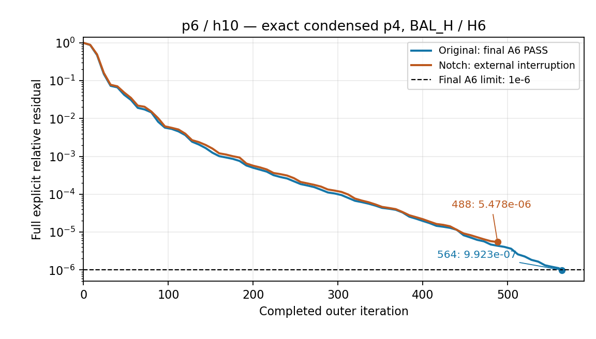

# Review V18 执行回复：Response V19

| 审阅问题 | 最终结论与边界 |
|---|---|
| 准确单元凝聚是否等价且省内存？ | **是，在本批规定输入与同口径 p4 control 上成立。** 原 A4、场/旋度、重复/线性及完整恢复通过；全过程 RSS 减少 **36.8152%**。 |
| 凝聚矩阵上的 BLR 是否有额外价值？ | **没有。** 唯一 tau=1e-5 质量通过，但实际因子条目只减少2.3564%，RSS反增1.4163%；选择准确凝聚进入p6。 |
| 完整 original p6/h10 是否通过？ | **通过。564步，独立原A6真实残差9.92314718715201e-7；完整场、80模式、近场、功率与守恒通过。** |
| 同配置 notch 是否通过？ | **尚未取得最终资格。** 完成494步，最后一次明确重算的真实残差是第488步5.478307207552461e-6。父watchdog随Codex空闲任务卸载而失联，随后worker报错；不是已证实的数值Gate失败。 |
| 最新用户指令后的动作 | 用户要求“修正后就不要恢复计算了，我看收敛的趋势很好，只需要知道其确实可以收敛的就行”。运行方式修复与轻量验证完成，**没有再启动或恢复PDE**；本轮交付后等待审阅。 |

原始模型已用实际最终残差证明收敛，无需从趋势推断。notch趋势良好仍不等于达到原1e-6门槛，也不构成任意模型的收敛保证。此前用户授权修复非数值bug后继续original，因此下列两次实现失败之后有第三次成功运行；费用与负记录均保留。最新停止指令覆盖尚未完成的notch续算，不改写Review或降低物理门槛。

执行范围仍为13.5 nm、MPI1/线程1、252 hex、p6/h10原矩阵（173802个存储坐标）与同网格p4、BAL_H/H6；未新增参考、扫描epsilon/rank/步数，未运行5 nm/0.7 nm或合并master。

## 准确p4与唯一BLR对照

单元凝聚把只属于单个单元的未知量先在单元内消去，再解共享边界和原 80 端口，最后恢复全部内部场。它改变全局分解的规模，付出局部 LU、右端项缩减、恢复和缓存的费用。本轮每个完整单元的 curl 与复材料项先相加，再形成 Schur；未先装配全局 p4，也没有 42 宏块或 42/252 份内部 MUMPS。252 个单元对应 5 类 raw 张量、12 类定向局部 LU；独立 trace 21,744 加 80 端口，全局为 21,824 行。每次非零输入只有一次全局 MatSolve，再恢复 27,216 个内部坐标，返回完整 53,084 坐标的 p4 slave-zero 向量。

缩减包含 `g_t−V_ti V_ii⁻¹ g_i` 和 `D_i V_ii⁻¹ g_i`；端口包含 `Bhat、Dhat、H+D_i V_ii⁻¹ B_i`，恢复为 `V_ii⁻¹(g_i−V_it c_t−B_i alpha)`。收到的输入已是 MPC dual storage，不重复施加 Cᴴ。当前材料/几何边界为已资格化轴对齐仿射 hex 与 cell-wise 材料；不宣称任意曲面通用支持。

| 冻结输入 | exact 原 A4 残差 | exact L2 | exact scaled-curl | BLR 原 A4 残差 | BLR L2 | BLR scaled-curl |
|---|---:|---:|---:|---:|---:|---:|
| A2R160_BAL_H_p4_01 | 7.52866012e-11 | 5.20206277e-12 | 5.19947161e-12 | 0.00762754585 | 0.000156967577 | 0.000153761427 |
| A2R160_BAL_H_p4_02 | 3.70778404e-12 | 5.21266719e-12 | 5.21031519e-12 | 0.000482348706 | 0.000248997417 | 0.000244243916 |
| LIGHT448_BAL_H_p4_09 | 6.72895057e-11 | 5.21310781e-12 | 5.21106919e-12 | 0.0110374087 | 0.000184090086 | 0.000180450982 |

exact 的 A4 限值为 1e-10、L2/curl 为 1e-8；BLR 局部筛选为 0.5/0.25。三组 exact 残差恒等式操作尺度检查通过 1e-10，所有返回的 slave 非零数为 0。额外重复01、01+i02、09−01的 A4 残差为 7.52866e-11、2.48054e-11、4.61608e-11；线性偏差为 0、1.83755e-13、1.76400e-13。全局 symbolic/numeric 始终各1次，累计6次 MatSolve，局部 LU 数目与身份不增长。

CSR 按实际 owned 行/列/complex128 内容流式计算，exact 与 BLR 同为 `19b9fbf759e6dc586d1316b53c69099647bd3a23e43378535b718c1db2c218d8`，8,184,464 个存储条目；factor 前后及 control 调用后相同。旧 Q1 缺 CSR hash 如实保留，不为此重跑。Q1 的同环境、同三输入、公共对象及因子保留轨迹可复用；本批未新增 matched full-p4 control。

内存单位均为 B；GB=10⁹ B，GiB=2³⁰ B。RSS/PSS 是连续同时进程树实测；allocated/used 是 MUMPS 各自原生整数 MB 加保守舍入，不能相互替代。

| p4 control / 历史对照 | 全过程 RSS | factor-live RSS | 保守库存峰值 | MUMPS allocated upper | MUMPS used upper |
|---|---:|---:|---:|---:|---:|
| Q1 原 full-p4 LU | 2825973760 | 2825973760 | 2906619390 | 2343000000 | 1382000000 |
| 旧 Q2 宏块 Schur，历史负对照 | 4267347968 | 见旧记录 | 4698023554 | 见旧记录 | 见旧记录 |
| U2 cell exact | 1785585664 | 1785585664 | 1776346158 | 1463000000 | 838000000 |
| U3 cell BLR | 1810874368 | 1810874368 | 1340346158 | 1027000000 | 874000000 |

U2 的已预分配矩阵账为 232,205,060 B，局部 LU/恢复/RHS 缓存合计 11,327,040 B（其中 LU 2,244,672 B），连同映射、公共对象和全局因子全部纳入库存。临时预留峰值 134,217,728 B；追加三次调用后的全 run RSS 仍为 1,785,585,664 B。不保留 raw/Schur 同义副本，不做 heap-trim 或提前释放因子优化。U2/U3 完成场的整机 reserve、8 GiB tree cap、6 GiB 库存、1 GiB 临时池、zero-job/new-global-swap 和最终进程清场均通过独立轨迹检查。notch 只有中断前的资源前缀，不能升级为完整资源通过。

U3 实际 ZMUMPS 输出为 5.6.2；35=2 与 tau 在 symbolic 前设置并读回，10=0，每次 solve 的 36/37/38=0/0/600。34 个 BLR fronts 覆盖85.5%，原生本矩阵条目40,282,272→39,333,043。初版 checker 错把初始化前默认 ICNTL38=0 当作运行值；改为检查每次实际 solve 的600，同时保留35/tau的symbolic前检查。初版负检查结果保留，仅重新读取证据，未重跑计算。

## 完整p6结果与接线

每次BAL_H保持两次在线p4调用及H6平滑。每个非零p4输入只做一次已建凝聚因子的全局MatSolve；无旧I4、C_U/S-p2、宏块、接口SVD、内层Krylov、refinement或recycling。因子跨调用复用，并保留到该场最终物理评价结束。

| original完整结果 | 实测值 | 原门槛/解释 |
|---|---:|---|
| 外层 | 564步，1次KSP创建/求解/销毁；FGMRES32，zero start，max2048 | 同一KSP持续到最终结果；未补R64 |
| 原A6真实残差 | 9.92314718715201e-7 | ≤1e-6；从保存的rhs/applied/residual/solution独立核验，恒等式偏差0 |
| 场L2 / scaled-curl相对误差 | 1.3644783292666524e-8 / 4.3714257232960455e-9 | 两项均≤1e-4；对既有离散参考，未重建参考 |
| R / T / A / A_volume | 0.3656257909689885 / 0.012990632321222292 / 0.6213835767097892 / 0.6213835745968793 | 各项对参考最大绝对差3.895936240283504e-9≤1e-5 |
| 80端口模式 | 幅度相对差4.285901366175889e-9，逐模式功率最大差1.8682987379392557e-9 | 门槛1e-4 / 1e-6；原排序、归一化、相位，无phase fit |
| E / H采样相对差 | 4.2910791901044614e-8 / 8.149307459590051e-9 | ≤1e-4；坐标完全匹配 |
| 界面切向E / H相对差 | 3.852540165461852e-8 / 1.4089312153555265e-7 | ≤1e-4 |
| 独立能量闭合及吸收一致性 | 两者均2.1129098470851204e-9 | 完整物理检查通过；非仅R/T摘要 |
| 实际PC调用 | 564次BAL_H，1128次全局MatSolve，564次H6；外层matvec581 | 无隐藏内层真实算子作用；全局symbolic/numeric各1 |
| BAL_H操作尺度闭合最大值 | 6.8467089344153964e-12 | ≤1e-8；所有保存边界的计数/输入身份核验通过 |

原始p6第32/64/128步真实残差为0.07312259254/0.01915747641/0.002444194505，通过原进展线。历史V5原始模型也需564步，最终约9.93229e-7；本轮证明保留其收敛能力，不能宣称减少迭代次数。p4 control的36.8152%是同scope内存收益，不当作完整p6相对V5的收益百分比。

图中只绘制实际保存的full explicit残差；不把notch第494步的KSP报告值5.15758355639567e-6替代第488步真实残差，也不外推到达1e-6的时间。

| notch中断证据 | 已知事实与缺口 |
|---|---|
| 最后完整检查点 | 第480步，真实残差5.763060073012618e-6；L2/curl=8.365792674860758e-8/4.430051055298203e-8，仅评价用参考 |
| 最后迭代/动作 | 494个完整PC；第495个PC的返回记录为completed=false。最后精确MatSolve总计未保存，unknown；按源码上界990，不伪造实测次数 |
| 父进程中断 | 2026-09-14 08:39:37 UTC，本地Codex记录当前任务无订阅且空闲而关闭；与最后parent heartbeat同秒；worker随后报告`V14 worker requires the dedicated parent watchdog` |
| 包装终态 | worker为FAILED/CLEANUP_FAILED；run_summary/run_manifest仍为launching/not_run，保留原状。父退出码、具体信号、最终总耗时unknown |
| 资源 | 20,113个父采样的已见RSS峰值2,012,508,160 B，VmSwap与全局新增swap均0；这些样本未触发资源线。缺父最终结算，因此完整资源资格unknown |
| 清场与结论 | 宿主进程空间复查父/mpiexec/worker三PID均不存在（其中MPI进程名为mpiexec）。未发现OOM或新EIO证据；没有最终official E/H、R/T/A、80模式与守恒通过记录，不宣称notch成功 |

## 非数值问题、修正与停止

| 事件 | 原失败与最小修正 | 后续资格 |
|---|---|---|
| U4第1次 | 旧`solve_limit==10800`检查拒绝observe_only的43200观察参数，KSP尚未创建。等值限制仅在enforce模式适用 | 第二次越过该检查；失败原件及费用保留 |
| U4第2次 | 第一个真实PC完成后，0秒观察参考值在记录处报错；清理又掩盖原异常。仅新V18改正观察值25/30秒，并先解除已返回PC的计时标记 | observe_only仍强制；第三次完整original通过。未改PC数学或放宽数值/资源门槛 |
| U5父监控失联 | Codex空闲任务卸载导致执行会话的parent watchdog丢失。新增20行薄入口`scripts/run_case_in_user_service.sh`，立即将原`run_case.py`置于用户systemd服务，保留原watchdog | 仅ABI探针及实际脚本`--help`成功退出，bash语法通过。没有定时器，没有新PDE，也没有服务方式完整模型资格声明 |

本机事件已保存原工具回读及hash，数据库日志可轮转；具体kill信号仍unknown。关于无订阅任务空闲后卸载的一般机制，可见[OpenAI App Server文档](https://learn.chatgpt.com/docs/app-server#api-overview)。本机因果判断还依据同秒parent heartbeat终止及worker监控失联错误，并非只依赖通用文档。

立即服务入口解决进程父级寿命，不引入新的算法、计时上限、审计平台或常驻轮询。可用`systemctl --user status <unit>`查看；wrapper本身仍调用已有case/资源逻辑。开发中过大的通用恢复校验草稿与后续未使用的重放草稿均未提交、未执行。当前没有活动计算，最新用户指令后正式PDE动作数为0。

## 全部费用与资源口径

| 正式场 / attempt | 全流程monotonic s | 保守结算 s | RSS B | 状态 |
|---|---:|---:|---:|---|
| U2准确control / 1 | 93.132393 | 103.412738 | 1785585664 | 完成；p4精度/资源通过 |
| U3凝聚BLR / 1 | 89.987755 | 98.824883 | 1810874368 | 完成；额外内存收益不通过 |
| U4 original / 1 | 147.527291 | 162.415457 | 2504851456 | 实现失败；仅失败场全流程，不是完整p6峰值 |
| U4 original / 2 | 123.891613 | 134.214571 | 1878298624 | 实现失败；只完成一个PC |
| U4 original / 3 | **6609.661379** | **7210.314085** | **2528460800** | 完整数值/物理/资源通过 |
| U5 notch / 1 | unknown；已见前缀5221.108862 | unknown；已见前缀5704.197024 | 已见前缀2012508160 | EXTERNAL_PARENT_LOSS；用户关闭续算 |

original第三场全过程RSS/PSS峰值为2,528,460,800/2,494,237,696 B；常驻保守库存1,830,284,886 B、临时工作区396,129,600 B。因子在最终评价后释放，原tree/reserve/库存/workspace/zero-swap及清场全部通过。单场完整monotonic约110.16分钟；保守结算约120.17分钟，二者不可混称。solver内7048.442077 s是包含检查点/评价的保守观察时钟，不是纯求解内核monotonic时间。

original凝聚setup32.365992 s；PC内结构作用、粗修正、H6平滑的operation计时分别为1761.412837/2067.498255/1431.463111 s；这是记录的子阶段口径，不覆盖全部后处理和父流程。U2 setup32.982125 s、numeric21.553870 s；三输入纯缩减—回代—恢复0.234487/0.210326/0.184217 s。U3 setup33.834831 s。Q1 numeric18.488779 s，减内存并未使numeric更快；Q1总时间536.468042 s含历史JIT/启动差异，不能与U2总时间直接相除宣称算法加速。Q1调用1.894626/1.856758/1.827991 s还包括native残差检查，与U2纯调用不同口径。

五个已结算场monotonic总7064.200431 s、保守结算总7709.181734 s；两次实现失败和两次重放费用均在内。加上notch已见前缀，monotonic已观测总量至少12285.309294 s，保守时钟至少13413.378757 s；**完整总时长仍unknown**，不能用前缀冒充完整结算。六次全局symbolic/numeric，五个完成场合计1139次MatSolve；notch最终次数unknown（源码上界990）。

为关闭已不存在进程的未结算预留，先保存不可变ledger快照，再以显式、幂等记录将U5旧43200秒预留转为政策占用；实际总耗时和settled仍null，已测7709.181734 s不变。当前政策占用43200 s、总预算占用50909.181734 s，无活动attempt；这是账务占用，**不是43200秒实测耗时**。时间继续observe_only，未恢复旧时间停止线；原bug重放计数2，基础设施重跑计数0。历史旧600秒仍仅政策占用，actual unknown，不清零或追溯改判。

工程时间单列：正式运行前可界定的UTC观察窗口7126.093486 s含root/Luna重叠开发、测试和等待，不是CPU时间；更早准备及后续修复/整理未独立计时，保持unknown。没有用工程修复重置正式费用。

## 身份、验收范围与交付

| 阶段 | 最终状态 | 正式source SHA |
|---|---|---|
| U0/U1 | 小fixture、身份、接线/清理通过；复用Q1与既有参考，不新增matched control | Q1参考：6a8b273c383d5bd9da37d6630a48bd24d6a90cce |
| U2 | 原A4与资源通过 | e1b5a398a199cdbc7c26ce3af8645daed2eeb7d6 |
| U3 | 质量通过，额外内存收益失败，选择exact | 5e95066d80579b0e135643f9fd114bd3dcc43424 |
| U4 attempt1 | 实现失败保留 | 4f15f7182289b3911bba6f766c5cd7e9a7026401 |
| U4 attempt2 | 实现失败保留 | 37e25d63fd5ac56ad95425a292ad291a7e564d56 |
| U4 attempt3 | ORIGINAL FULL PASS | 8a2d5cbba6ed834a6d731a30dd3735c8824fa762 |
| U5 attempt1 | 外部父监控失联；未达最终A6，用户关闭续算 | c56437271a4e3c34c984e4c3dee111b61dc5130e |
| U6 | 统一证据与修正收口，等待审阅；不自动再运行 | 最终提交SHA由Git回执给出，避免文档自引用 |

base为`96827e89ce5ba446c4faa7cb507b777f21953af8`，分支`task39extra`，canonical登记worktree；不修改5nm线。实际ABI为qualified WSL complex128/int32、PETSc3.19.6、DOLFINx/Basix0.10、SLEPc3.19.2、MPI3.1.5、MUMPS5.6.2，无升级。原始成功solution hash为`3792b2e3d1bce25c8be6a1cd22a08bf37f5132a94d2ed43436db421120230007`；各输入、reference、CSR、factor前后、运行命令/线程、raw文件hash见compact及独立checker。

最终相关测试106 passed in2.74s；共享helper此前串行4 passed，MPI2三个fixture各rank3 passed；original只读checker/ledger28项通过。服务ABI探针与`--help`成功，未运行新的PDE。文档与模型登记合同21 passed in0.06s；修正一处历史证据路径遗漏records/，原数据和结论未变，初次失败日志保留。JSON/hash与身份最终复核见test_summary与收口记录；Ruff未安装，全仓pytest/MPI4/CI未运行，不声称通过。

证据入口：[统一结果](outcomes/p4_cell_condensed_v18.md)、[compact](outcomes/records/p4_cell_condensed_v18_compact.json)、[decision](outcomes/records/p4_cell_condensed_v18_decision.json)、[run index](outcomes/records/run_index.json)、[测试](outcomes/test_summary.md)、[合并边界](outcomes/selective_merge_manifest_v19.md)。旧41份冻结文件、原30项run前缀和全部失败保存；重型向量/矩阵/轨迹保留ignored目录，Git包含数值、轻量曲线、精确身份与hash索引。

当前准确凝聚可作为已在本机原始p6/h10验证的显式研究路径；notch最终资格、任意几何或更大模型可扩展性均未证明。ordinary default不变，master merge未批准。提交推送同一分支后等待ChatGPT统一审阅。
