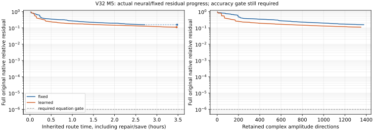

# V32多尺度神经支持：机制、真实场结果与资源边界

本轮查明：保存空间没有严格零支持cell，底部导数P·U也不是严格零；“缺底部覆盖”假设未证实。新神经路线实际发生241次非零已提交连续q更新，保留1350个复方向。但M5原native/增广残差0.111824065796、散射E相对差0.0423218706136，联合Gate仍失败，没有同精度20%神经资源收益。关闭本批FIXED_MULTISCALE_WAVE_BLOCK / LEARNED_MULTISCALE_WAVE_BLOCK的这份配置，不能推广为所有神经方法不可能。条件0.7nm真实缩小pilot未运行。

## 同一完整有限元问题中的新函数

M5是λ5nm、384个六面体的Si/air真实三维缺口，p3 Nédélec第一类、31968独立复FE、40端口及双Floquet。网络点值经所有边/面/内部矩、Piola、方向与一次MPC展开进入原离散空间；体/DtN q15不变，网络矩q30、独立q60。Si=0.99396854453+0.00435380777i，原统一表hash与A/f/moments/mesh/mode绑定于[设计](records/design_v32.json)。没有端口trace退化、传统PC、原A逆、全局Gram逆或额外FE细化。

局部支持是选择函数在哪些区域有作用的窗口；全域chi=1使其能直接影响整个单胞。旧策略后期只生成细尺度，新的池保留全域、粗、中、细以及固定z/端口轮转。A* r仅用于同尺度便宜预选，最终比较完整原作用后的投影下降。前两窗口完整固定评分后，实际q学习在选中的finalist上执行；不宣称两个窗口都接受非线性优化。

```math
E_\theta(x)=\sum_{j,\nu}\chi_j(x)p_{j\nu}\exp\{{\rm i}q_{j\nu}\cdot(x-x_j)\},\qquad c=I_hE_\theta.
```

```math
r=f-Ac,\quad Z=(I-QQ^*)AC,\quad S(C)=\|P_{\mathrm{range}(Z)}r\|_2^2.
```

这里Q是已保留神经函数经过原A作用后的正交列，不是全FE逆。每块保留独立复幅值方向，后续全部幅值共同重组合，旧q冻结；两遍投影、小QR/SVD、固定rcond1e-12和原A复算保护近相关块。新C固定seed4213201，零散射起点，不用旧3858列或监督权重。冻结设计含8窗口、方向界、12iter/18实际调用守卫、轮转和共同慢降扩宽规则，不扫描半径/损失/截断。

## 保存覆盖假设及独立机制见证

原学习3858列及固定保存空间的MPC展开没有严格零cell，没有阈值裁零；底部P·U为浮点微小非零，数值秩诊断不能当精确秩。原相同T不能证明空间缺底部；严格零cell离散误差下界为0，同样不能证明表示充分。z、Si/air及边/面/内部计数为保存系数支持诊断，系数能量不是物理场误差。独立参考只算该下界，误差分布不送回训练。[完整覆盖证据](records/saved_space_coverage_v32.json)。

24列无标签见证比较原学习终态上的全域/各尺度/旧选区得分。全域入射/反射得分约0.001483/0.001357，粗/中/细AH预选约0.000374/0.000242/0.00000754，旧r细选约0.00002056；不同尺度有机会，细AH并非总优于旧r。没有提交该旧状态更新，没有新teacher。[原方向/分母](records/unlabelled_direction_witness_v32.json)。

## 从零两路线和完整数值门

| measured；同M5/λ5nm/384hex/p3/31968复FE/40端口 | 固定多尺度控制 | 学习多尺度神经 | 原门及边界 |
|---|---:|---:|---|
| 保留复方向 / 接受块 | 1377 / 246 | 1350 / 241 | 共同4096容量，独立零散射起点 |
| 实际非零已提交q更新 | 0 | 241 | 连续q真实优化；不强制扰动 |
| native / augmented原残差 | 0.157431767049 / 0.157431767049 | 0.111824065796 / 0.111824065796 | 各≤1e-6 |
| 独立total原残差 | 0.0745757053209 | 0.052971256913 | ≤1e-6；原total RHS |
| 散射E相对L2差 | 0.0288946898255 | 0.0423218706136 | ≤1e-4；原参考分母 |
| 总E相对L2差 | 0.0198146530522 | 0.0290223978106 | ≤1e-4 |
| 散射H / scaled-curl相对差 | 0.0289677399528 | 0.0423056325836 | ≤1e-4；同原H单位 |
| 模型→完整矩重建相对差 | 8.91426760953e-13 | 5.0500950991e-15 | ≤1e-10；全部内部矩保留 |
| R / T / A_balance，诊断 | 0.8058557873 / 0.03196918217 / 0.1621750306 | 0.8005600005 / 0.03447361115 / 0.1649663883 | 非official；差值原门各≤1e-5 |
| 独立A_volume，诊断 | 0.152331141191 | 0.161769367016 | 体积分，误差≤1e-5 |
| R00_s / R00_p / R00_total，诊断 | 0.8057819472 / 5.458602451e-07 / 0.805782493 | 0.8004588516 / 9.452904899e-10 / 0.8004588526 | 三项分列；完整40模式另存CSV |
| 独立体吸收能量闭合 | 0.00984388938608 | 0.00319702129457 | ≤1e-5；不是A=1−R−T恒等式 |
| 最大逐级功率绝对差 | 0.00647487128873 | 0.0117979668499 | ≤1e-6 |
| 本路线实际学习attempt / s | 9572.249428 | 11982.685081 | 准入/setup/试探/存盘均计；其他审核另列 |
| 含本路线早期审核/读出修复 / s | 10186.178641 | 12180.057796 | 共享最终审核仅在项目账计一次 |
| 本路线采样同时整树峰 / B | 5290643456 | 2288005120 | 自身swap0；不是阶段峰相加 |




图中的横轴一是继承准入/暂停/修复的原路线时间，另一是保留方向数；失败试探不画成接受更新。它仅展示原残差，没有把较小残差、较少列或采样峰当神经净收益。同512容量附近学习场反而差于fixed，旧V31约99.9%的场误差仅作不同机制历史负对照，不构成单因素因果证明。

实际网络与producer都评分，四类完整复通道及每级功率按原物理key/极化/side/参考面对齐，不拟合整体相位。H_code=curl(E)/(i*k0*mu_r)，scaled-curl与H共享原单位约定；所有近零分母与绝对差在[指标索引](records/full_metric_index_v32.csv)及[完整Gate](records/full_numerical_gates_v32.json)。独立保存checker从原数组重算，不只读status。总/散射全场、六点、全部40复通道、体吸收能量与材料/界面均实际完成。即使求积/MPC/参数映射通过，其他门失败仍是联合FAIL。

## 修复、成本及可扩展性

固定small-R配对拒绝后保全原完整边界，准确原AU经济型QR不改变已有U/波/列序/rcond。一次数值角色遗漏触发正确2GiB监督停止；最小分类修复后真实资格峰5290643456B，原作用配对9.3894e-11、点值重建8.9143e-13，再从原时钟恢复。旧失败、受影响counter的NOT_RETAINED和全部墙钟保留；不是Maxwell factor或修改物理门。socket路径同批最小修好，真实封存与清场都绑定自己的身份。[修复账](records/repair_journal_v32.json)。

固定及学习的加载packet、方向筛选/矩/梯度、原A/A*、小系统、存盘和全部attempt分别计费。共享最终独立审核800.492336s只计一次；路线归属可给保守上界，完整冷N=1因健康旧准备复用为UNKNOWN，不虚造新的成功冷对照。历史准确参考672.462895s/1245822976B不是本轮新鲜同精度分母。[成本](records/cost_and_capacity_v32.json)、[监督采样与PSI](records/resource_costs_v32.json)。

U/Q存储为32Nm字节。N=1e7、m4096时单此两对象1.31072e12B，是形状推导示例，不是目标实际DoF/RSS，尚未含原算子/R/暂存/系统余量。更快的单次缓存或更低未合格残差不够授20%NN收益。本批没有为此开发存储或传统求解工程。

## 条件推进和关闭范围

本M5学习联合FAIL，因此长度×0.14、统一λ0.7材料的真实三维缩小pilot是NOT_RUN_M5_LEARNED_JOINT_GATE_FAILED；不拿解析平面波或另一个Si值替代。完整原目标仍未达。关闭的是这份有限预算、多尺度native-block greedy配置，而非所有神经研究；不自动追加第三路线/改loss/调权/加p/h/端口/长训练。原较好M3600、终态退化、D0成本否决/D1未运行和旧FAIL/UNKNOWN/费用保留。

source=a11c3ae2157f42a6874e54ec6cec29ab57fe0b81，完整固定前缀与读出修复source在[run index](records/run_index_v32.json)，文档HEAD另报；[targeted tests](records/tests_v32.json)、[selective依赖](records/selective_merge_manifest_v32.json)。生产默认不变、未获merge或初始化许可。GitHub有限新页视觉结果另绑定，不把Markdown解析通过当全页视觉PASS。

有限GitHub首屏检查及公式宏原失败/最小修复见[呈现记录](records/render_check_v32.json)。受影响新专题页仅复查一次，首屏两条公式已实际目视通过，旧宏失败保留；不重渲染历史，未覆盖整页/全表保持NOT_VERIFIED。
