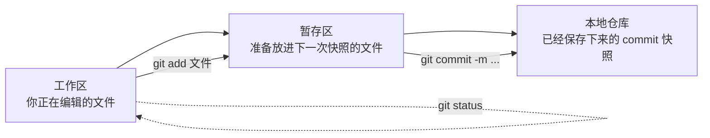
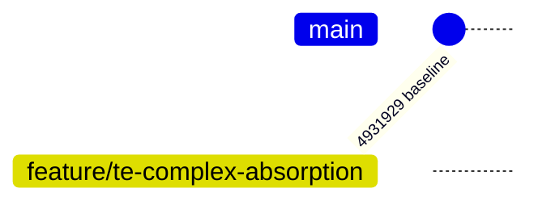
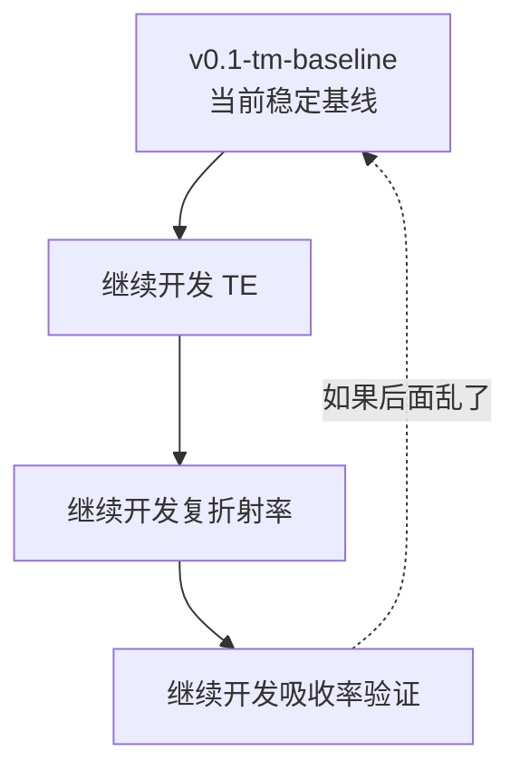
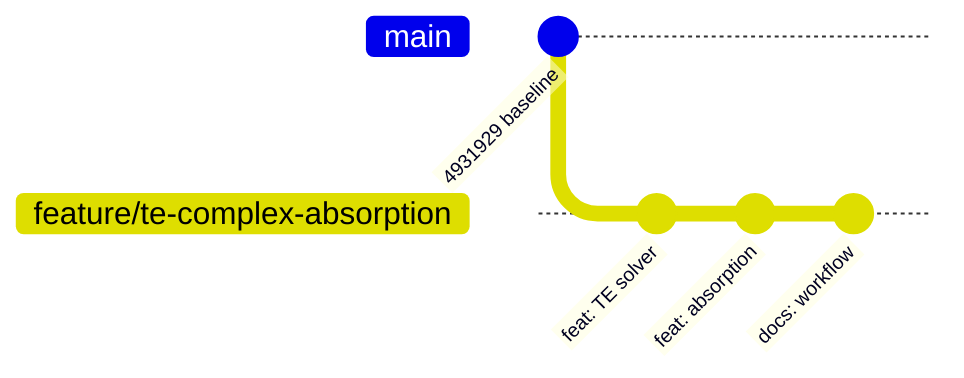
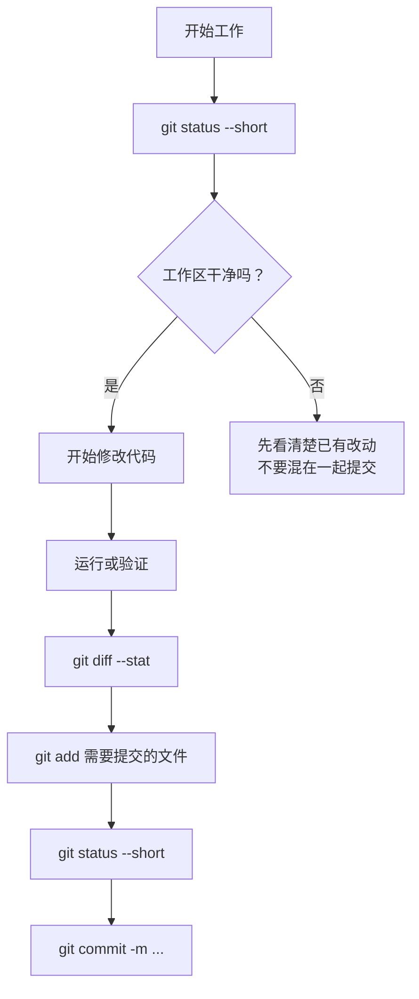
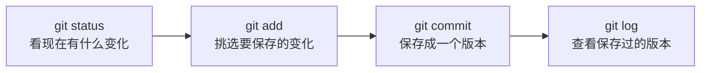

# Git 可视化入门：用当前 Maxwell 项目理解版本管理

这份文档面向第一次使用 Git 的读者。你不需要先背很多命令，只要先理解 Git 在帮你做什么：

```text
Git = 给代码拍快照 + 给不同开发路线取名字 + 允许以后回到某个快照
```

当前项目目录是：

```text
C:/Users/admin/Desktop/Code/fenics_vector_maxwell_floquet_demo_v2_parallel
```

当前已经建立好的 Git 状态是：

```text
当前分支: feature/te-complex-absorption
baseline commit: 4931929 chore: initialize Maxwell Floquet simulation baseline
baseline tag: v0.1-tm-baseline
```

注意：因为 Git 是在当前代码已经包含 TE、复折射率、吸收率扩展之后才初始化的，所以这个 baseline 是“当前项目状态”的基线，不是“TE 开发之前”的历史版本。

## 1. Git 的三个区域

你可以把 Git 想成三层：



对应到人的操作就是：

```text
1. 你修改代码或文档
2. git status 看改了什么
3. git add 挑选哪些改动要进入下一次快照
4. git commit 真正保存这次快照
```

最重要的一点：

```text
git add 只是放入暂存区，还没有真正形成历史记录。
git commit 才是真的保存一个可回退版本。
```

## 2. 当前仓库长什么样

现在仓库刚创建，一个 baseline commit 同时被三个名字指着：



用文字说就是：

```text
master/main 位置: 4931929
tag v0.1-tm-baseline: 4931929
feature/te-complex-absorption: 4931929
```

`tag` 像一个永久书签，用来标记“这个版本很重要”。  
`branch` 像一条开发路线，后面可以继续往前走。

## 3. 为什么要有 baseline tag

`v0.1-tm-baseline` 的作用是：以后你改坏了代码，也能知道“稳定基线”在哪里。



查看这个标签：

```bash
git tag
```

查看标签指向哪个 commit：

```bash
git log --oneline --decorate -5
```

## 4. 分支是什么

分支可以理解为“另一条时间线”。

现在后续开发应该在：

```text
feature/te-complex-absorption
```

上进行。

未来可能长这样：



这样做的好处是：

```text
baseline 不动
新功能在 feature 分支上逐步推进
每一步都有 commit 可回退、可比较
```

## 5. 每天最常用的 5 个命令

先进入项目目录：

```powershell
cd C:\Users\admin\Desktop\Code\fenics_vector_maxwell_floquet_demo_v2_parallel
```

因为你当前 Windows PowerShell 里没有原生 `git`，之前我是通过 Docker 里的 Git 操作的。你在 PyCharm 里如果配置了 Git，也可以直接用 PyCharm 的 Git 面板；如果命令行没有 Git，可以继续用 Docker 方式。

如果本机以后装好了 Git，常用命令如下。

### 5.1 看当前状态

```bash
git status --short
```

常见输出：

```text
 M src/main.py              已修改，但还没有暂存
A  notes/new_doc.md         新文件，已经暂存
?? scratch.txt              Git 还没跟踪的新文件
```

### 5.2 看具体改了什么

```bash
git diff
```

看已经暂存、准备提交的内容：

```bash
git diff --cached
```

只看统计：

```bash
git diff --stat
git diff --cached --stat
```

### 5.3 把文件放入暂存区

暂存某个文件：

```bash
git add src/main.py
```

暂存所有当前没有被 `.gitignore` 忽略的改动：

```bash
git add .
```

### 5.4 创建一次 commit

```bash
git commit -m "feat: add scalar TE solver"
```

提交信息建议用这种格式：

```text
feat: 新功能
fix: 修 bug
docs: 文档
test: 测试或验证
chore: 环境、整理、杂项
```

### 5.5 看历史

```bash
git log --oneline --decorate --graph --all
```

它会用一行一个 commit 的方式显示历史。

## 6. 推荐的日常工作流

每次准备改代码前：



最稳的习惯是：

```text
一个 commit 只做一件相对独立的事。
```

例如不要把“修 PML 公式”“改 PyCharm 文档”“清理结果文件”混成一个 commit。

## 7. 哪些东西不要提交

当前 `.gitignore` 已经排除了：

```text
results/
outputs/
output/
__pycache__/
.idea/
.vscode/
*.vtu
*.pvd
*.xdmf
*.h5
*.bp
*.png
*.csv
*.msh
*.log
tmp/
```

也就是说，仿真结果、大型可视化文件、缓存文件默认不会进入 Git。

如果以后确实需要保存小型验证 CSV，请放到：

```text
tests/reference_data/
```

这个目录下的 CSV 已经在 `.gitignore` 里做了例外。

## 8. 如何确认没有误提交结果文件

提交前先看：

```bash
git status --short
git diff --cached --stat
```

如果看到这些，就要小心：

```text
results/
*.vtu
*.h5
*.bp
*.png
*.msh
```

如果已经误暂存了，可以从暂存区拿掉，但保留本地文件：

```bash
git restore --staged results/
git restore --staged path/to/file.vtu
```

这不是删除文件，只是取消“准备提交它”。

## 9. 如何回到某个版本

先看历史：

```bash
git log --oneline --decorate --graph --all
```

如果只是想查看 baseline 当时的代码，可以临时切到标签：

```bash
git checkout v0.1-tm-baseline
```

这会进入 detached HEAD 状态，意思是“只是在查看某个历史快照”。看完以后回到开发分支：

```bash
git checkout feature/te-complex-absorption
```

如果只想恢复某一个文件到 baseline 的样子：

```bash
git restore --source v0.1-tm-baseline -- src/main.py
```

这会修改工作区里的 `src/main.py`，你还需要检查并 commit。

新手阶段不建议随便用：

```bash
git reset --hard
```

它会丢弃未提交改动，风险比较高。

## 10. 如何用 Git 做对比

比较当前工作区和最近一次 commit：

```bash
git diff
```

比较当前分支和 baseline：

```bash
git diff v0.1-tm-baseline..HEAD --stat
```

看某个文件从 baseline 到现在的变化：

```bash
git diff v0.1-tm-baseline..HEAD -- src/solvers/solve_te_maxwell.py
```

看两个版本之间哪些文件变了：

```bash
git diff --name-status v0.1-tm-baseline..HEAD
```

## 11. 当前项目建议的提交节奏

后面继续开发时，建议按功能拆 commit：

```bash
git commit -m "feat: support complex refractive indices"
git commit -m "feat: add scalar TE solver"
git commit -m "feat: add absorption postprocessing"
git commit -m "test: add Fresnel validation for TE and TM"
git commit -m "docs: document polarization and absorption workflow"
```

每次 commit 前先执行：

```bash
git status --short
git diff --stat
git diff --cached --stat
```

确认没有把仿真结果、大图片或缓存提交进去。

## 12. 如果你只记三个命令

最开始只记这三个就够了：

```bash
git status --short
git add .
git commit -m "说明这次做了什么"
```

再加一个看历史：

```bash
git log --oneline --decorate --graph --all
```

它们对应的图是：



Git 一开始会显得有点抽象，但在这个项目里你可以把它当成“仿真代码的实验记录本”：每次公式、边界条件、后处理指标有明确变化，就拍一张清晰快照。这样以后和 COMSOL 对比时，能准确知道每个结果是由哪版代码算出来的。
